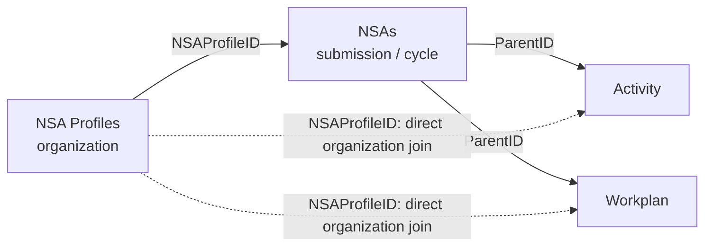

# End-to-End NSA Data Relationship Validation

| Item | Value |
|---|---|
| System | PAHO Non-State Actors Public Report |
| Environment | DEV |
| Validation date | 2026-08-01 |
| Authoritative reference | `NSA.Tool.Data.Structure.for.Public.Report.pdf` |
| Result | **Relationships validated with documented data exceptions** |
| Handover status | **Ready for ITS review** |

## Objective

Validate that the four exported JSON datasets follow the relationships and
report-field rules defined by `NSA.Tool.Data.Structure.for.Public.Report.pdf`.
The detailed checks use Profiles 43, 44, and 46 because they contain the most
complete relationship data. Profile 11 is included only as an informative case
for missing `GovBodies_Status` values.

This is a persisted-data validation. It does not use `TypeOfSubmission` as the
current submission-type filter and does not infer workflow behavior beyond the
rules documented in the PDF.

## Sources and scope

- `nsa-profiles.json`
- `nsa.json`
- `activity.json`
- `workplan.json`

Extension is not included because it is not a value defined by the PDF for
`NSA_Status` or `TypeOfSubmission`.

## Relationships defined by the PDF

```text
NSA Profiles.ID -> NSAs.NSAProfileID
NSAs.ID          -> Activity.ParentID
NSAs.ID          -> Workplan.ParentID
NSA Profiles.ID  -> Activity.NSAProfileID
NSA Profiles.ID  -> Workplan.NSAProfileID
```



The two child relationships have different purposes:

- `ParentID = NSAs.ID` identifies the exact submission/cycle.
- Child `NSAProfileID = NSA Profiles.ID` confirms organization ownership.

`NSAProfileID` must not replace `ParentID` when retrieving records for a
specific cycle because one organization can have multiple NSA records.

## Field usage defined by the PDF

| Requirement | Correct field | Rule |
|---|---|---|
| Current submission type | `NSAs.NSA_Status` | Use for New Application, Renewal, or Progress Report filtering |
| Original submission type | `NSAs.TypeOfSubmission` | Stores New Application or Renewal origin; **do not use as the current type filter** |
| Governing Bodies decision | `NSAs.GovBodies_Status` | Durable decision used for report filtering/display |
| Workflow progress | `NSAs.Status` | Internal progress only; not the type or eligibility filter |
| Public-report eligibility | `NSAs.GovBodies_Status` | Eligible when Pending or Approved, according to the PDF |
| Organization type | `NSA Profiles.NSAOrganizationType` | Use for organization-type filtering |
| Collaboration period | `NSAs.CollaborationPeriod` | Use for collaboration-period filtering |
| Backend extracted-cycle lookup | `NSA Profiles.RenewalKey` | Indexed backend key only; no report-facing role |

`RenewalKey` stores the ID, as text, of the organization's most recently
extracted NSA submission. It does not replace `NSAProfileID` or `ParentID` and
must not be used for public display, filtering, or eligibility. “Most recently
extracted” does not necessarily mean the highest ID, newest cycle, or approved
cycle.

## Relationship validation results

### Summary

| Profile | Profile to NSAs | Children by `ParentID` | Child organization ownership | `RenewalKey` | Result |
|---:|---|---|---|---|---|
| 43 | Cycles 96 and 97 match Profile 43 | 4 valid; 4 orphan records use missing parent 60 | All 8 children retain `NSAProfileID = 43` | 96 resolves to cycle 96 | Partial pass |
| 44 | Cycles 100 and 101 match Profile 44 | All 4 children resolve to cycle 100 | All 4 children retain `NSAProfileID = 44` | 100 resolves to cycle 100 | Pass |
| 46 | Cycles 94, 95, 98, and 99 match Profile 46 | All 8 children resolve to an exported cycle | All 8 children retain `NSAProfileID = 46` | 95 resolves to cycle 95 | Pass |
| 11 | All 13 cycles match Profile 11 | All 27 children resolve to an exported cycle | All 27 children retain `NSAProfileID = 11` | 91 resolves to cycle 91 | Relationship pass; status case only |

### Profile 43

Valid chain:

```text
NSA Profile 43
  -> NSA 96 (NSAProfileID 43, GovBodies_Status Approved)
     -> Activities 42, 43 (ParentID 96, NSAProfileID 43)
     -> Workplans 73, 74 (ParentID 96, NSAProfileID 43)
  -> NSA 97 (NSAProfileID 43)
```

The organization and cycle relationships above pass. Separately, Activities
38 and 39 and Workplans 60 and 61 also carry `NSAProfileID = 43`, but their
`ParentID = 60` does not resolve because `NSAs.ID = 60` is absent. These four
records pass the direct organization join but fail the required cycle join.

### Profile 44

```text
NSA Profile 44
  -> NSA 100 (NSAProfileID 44, GovBodies_Status Approved)
     -> Activities 45, 46 (ParentID 100, NSAProfileID 44)
     -> Workplans 79, 80 (ParentID 100, NSAProfileID 44)
  -> NSA 101 (NSAProfileID 44)
```

All organization and cycle relationships pass. There are no orphan children
for Profile 44.

### Profile 46

```text
NSA Profile 46
  -> NSAs 94, 95, 98, 99 (all use NSAProfileID 46)
  -> Activities 41 and 44 (parents 94 and 99)
  -> Workplans 71, 72, 75, 76, 77, 78 (parents 94, 95, and 99)
```

All organization and cycle relationships pass. There are no orphan children.
`RenewalKey = 95` resolves to `NSAs.ID = 95`, which belongs to Profile 46.
Cycle 95 has `GovBodies_Status = Not Approved`; this confirms that
`RenewalKey` is a backend extracted-cycle key, not an approval or eligibility
field.

### Profile 11 — informative status case

Profile 11 has 13 NSA cycles, 6 Activities, and 21 Workplans. All child
`ParentID` values resolve and all records retain `NSAProfileID = 11`, so its
relationships pass.

However, every Profile 11 NSA record has `GovBodies_Status = null`. Cycles 91
and 92 contain `GovBodies_Outcome = Approved`, but the PDF says
`GovBodies_Outcome` is a working field and is not reliable as a report filter.
Without a durable `GovBodies_Status`, Profile 11 cannot be used as a positive
example of Governing Bodies approval or public-report eligibility.

## Full-export exceptions

The relationship review confirms two data-integrity exceptions:

1. `NSAs.ID = 41` has a blank `NSAProfileID`; its organization relationship
   cannot be resolved.
2. Four Profile 43 children have no exported cycle parent:
   - Activities 38 and 39 use `ParentID = 60`.
   - Workplans 60 and 61 use `ParentID = 60`.
   - `NSAs.ID = 60` is not present in `nsa.json`.

These exceptions do not invalidate the separate valid Profile 43 chain through
cycle 96, but they remain failures of the PDF-defined relationship model.

## Conclusion and ITS handover

The JSON structure implements the relationship model defined by the PDF:

- `NSAProfileID` consistently identifies the organization in the validated
  Profiles 43, 44, and 46.
- `ParentID` correctly identifies the exact cycle for every cited child except
  the four confirmed Profile 43 orphans.
- Profiles 44 and 46 pass all examined relationship checks.
- Profile 43 passes through cycle 96 and partially passes overall because of
  the missing cycle 60.
- Profile 11 passes relationship checks but cannot validate approval or public
  eligibility because `GovBodies_Status` is null.

The report must use `NSA_Status`, `GovBodies_Status`,
`NSAOrganizationType`, and `CollaborationPeriod` according to the PDF. It must
not use `TypeOfSubmission`, `Status`, or `RenewalKey` as substitutes for those
report-facing fields.

**Handover:** Ready for ITS review with the two confirmed data-integrity
exceptions documented above.
