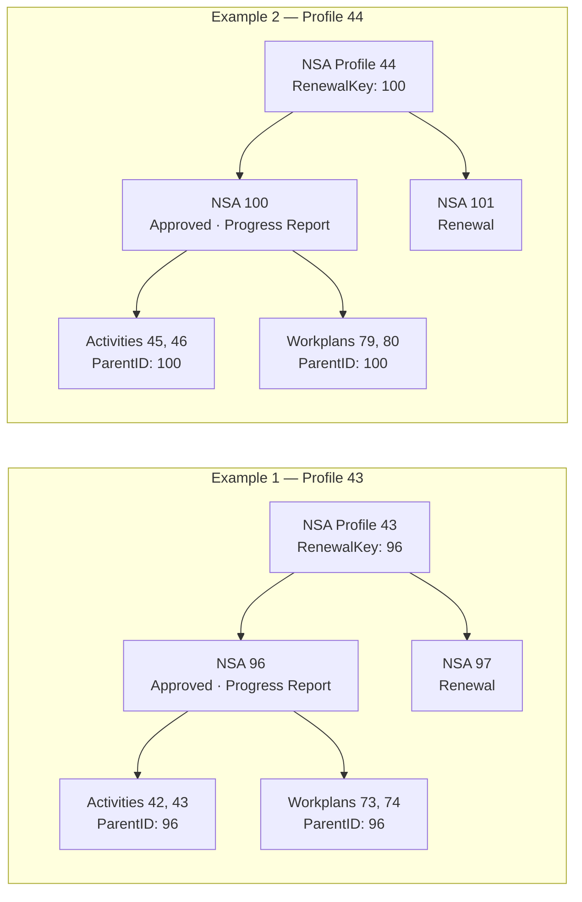

# End-to-End NSA Data Workflow Validation

| Item | Value |
|---|---|
| System | PAHO Non-State Actors Public Report |
| Environment | DEV |
| Validation date | 2026-08-01 |
| Result | **Pass for the supported data workflows, with documented export exceptions** |
| Handover status | **Ready for ITS review** |

## Executive summary

The validation was repeated using
`NSA.Tool.Data.Structure.for.Public.Report.pdf` as the authoritative definition
of the workflow and `Validate-DEV-Database-Changes.md` as the structural
baseline already delivered.

The PDF defines three supported submission states: New Application, Renewal,
and Progress Report. It does not define Extension as an NSA submission type;
therefore Extension is not applicable to this data model.

Profiles 43 and 44 were selected as representative end-to-end examples because
each contains a stable organization record, an approved NSA cycle that has
progressed to Progress Report, a separate Renewal cycle, Activity and Workplan
children, and a populated indexed `RenewalKey`.

Both examples pass the expected persistence rules:

- `NSAProfileID` remains stable across cycles for the same organization.
- Each cycle has its own `NSAs.ID`.
- `RenewalKey` identifies the approved prior cycle.
- Activity and Workplan records use the prior cycle ID as `ParentID` and retain
  the same `NSAProfileID` as the organization.
- Workplans preserve reported results by year.

The full export still contains previously documented exceptions, but they do
not affect the two validated chains. The JSON files are not generally missing
workflow data; specifically, two Profile 43 Activity records and two Profile
43 Workplan records are confirmed as having no parent because their
`ParentID = 60` does not resolve to an exported NSA record. The export also
contains one unrelated NSA row with no profile ID.

## Sources and scope

| Source | Purpose |
|---|---|
| `../files/NSA.Tool.Data.Structure.for.Public.Report.pdf` | Authoritative list, field, relationship, filter, and supported-status definition |
| `Validate-DEV-Database-Changes.md` | Previously delivered validation of the complete DEV export and its known exceptions |
| `nsa-profiles.json`, `nsa.json`, `activity.json`, `workplan.json` | Record-level evidence for Profiles 43 and 44 |

The PDF establishes the following rules:

```text
NSA Profiles.ID -> NSAs.NSAProfileID
NSAs.ID          -> Activity.ParentID
NSAs.ID          -> Workplan.ParentID
NSA Profiles.ID  -> child.NSAProfileID
```

It also establishes that:

- `NSA Profiles` is the stable organization source across cycles.
- `NSAs` stores one record per submission/collaboration-period cycle.
- `NSA_Status` is the current submission-state field.
- `TypeOfSubmission` retains New Application or Renewal and must not be used as
  the current state after the record advances to Progress Report.
- `GovBodies_Status` is the durable Governing Bodies decision.
- `RenewalKey` is indexed and stores the ID of the most recently extracted NSA
  submission.

## Supported scenario coverage

| Scenario | Result | Evidence |
|---|---|---|
| New Application | Pass | Cycles 96 and 100 retain `TypeOfSubmission = New Application`; their Activities and Workplans were persisted |
| Progress Report | Pass | Cycles 96 and 100 have `NSA_Status = Progress Report`; Workplans preserve Year 1 and Year 2 reported results |
| Renewal | Pass | Cycles 97 and 101 are distinct Renewal records and retain the organization ID of their prior cycles |
| Extension | Not applicable | The authoritative PDF does not define Extension in `NSA_Status` or `TypeOfSubmission` |

## Validated relationship samples



### Example 1 — NSA Profile 43

| List | IDs | Relationship and state | Result |
|---|---|---|---|
| NSA Profiles | 43 | `RenewalKey = 96` | Pass |
| NSAs | 96 | `NSAProfileID = 43`; `GovBodies_Status = Approved`; current `NSA_Status = Progress Report` | Pass |
| NSAs | 97 | `NSAProfileID = 43`; `NSA_Status = Renewal` | Pass |
| Activity | 42, 43 | `ParentID = 96`; `NSAProfileID = 43` | Pass |
| Workplan | 73, 74 | `ParentID = 96`; `NSAProfileID = 43`; Year 1 and Year 2 reported | Pass |

This chain demonstrates that the organization remains Profile 43 while cycles
96 and 97 remain distinct. The approved prior cycle is retrievable through
`RenewalKey = 96`, and the validated children belong to that exact cycle.

### Example 2 — NSA Profile 44

| List | IDs | Relationship and state | Result |
|---|---|---|---|
| NSA Profiles | 44 | `RenewalKey = 100` | Pass |
| NSAs | 100 | `NSAProfileID = 44`; `GovBodies_Status = Approved`; current `NSA_Status = Progress Report` | Pass |
| NSAs | 101 | `NSAProfileID = 44`; `NSA_Status = Renewal` | Pass |
| Activity | 45, 46 | `ParentID = 100`; `NSAProfileID = 44` | Pass |
| Workplan | 79, 80 | `ParentID = 100`; `NSAProfileID = 44`; Year 1 and Year 2 reported | Pass |

This chain demonstrates the same result independently: Profile 44 remains the
organization identity, the prior and Renewal cycles are not overwritten, and
all four children resolve to approved cycle 100.

## Validation results

| Requirement | Result | Conclusion |
|---|---|---|
| Organization identity persists across cycles | Pass | Profiles 43 and 44 remain unchanged across their prior and Renewal cycles |
| New Application data is captured | Pass | Prior cycles and their Activity and Workplan rows are present |
| Progress Report data is processed and retained | Pass | Current state and per-year Workplan results are persisted |
| Renewal creates a separate cycle | Pass | IDs 97 and 101 are separate from prior cycles 96 and 100 |
| Children resolve to the correct cycle | Pass | All children cited in the two validation samples have matching `ParentID` and `NSAProfileID` |
| Approved status remains available | Pass | Cycles 96 and 100 retain `GovBodies_Status = Approved` |
| Indexed join value is populated correctly | Pass at data level | `RenewalKey` values 96 and 100 resolve to the intended approved cycles |
| Results are documented for ITS | Pass | Sources, IDs, expected relationships, actual results, exceptions, and acceptance are recorded here |

## Export exceptions and interpretation

The complete-export exceptions remain as recorded in
`Validate-DEV-Database-Changes.md`:

1. `NSAs.ID = 41` has a blank `NSAProfileID`.
2. Profile 43 has four confirmed orphan child rows with `ParentID = 60`, while
   `NSAs.ID = 60` is absent from the supplied export:
   - Activities `38` and `39`
   - Workplans `60` and `61`

This confirms two Activity and two Workplan records without a parent in the
validated dataset. It does not invalidate the separate, complete Profile 43
chain through cycle 96, but the four orphan records must remain a documented
data-integrity exception for ITS.

## Indexing conclusion

The data-level regression condition passes for the representative examples:
the indexed `RenewalKey` is populated with `96` for Profile 43 and `100` for
Profile 44, and each value identifies the correct approved prior cycle.

The PDF confirms that `RenewalKey` is indexed. The exports cannot inspect the
deployed SharePoint list configuration or prove query performance; those are
infrastructure checks rather than missing data in the validated JSON chains.
If ITS requires operational index certification, the handover should include a
SharePoint index-settings capture and an execution trace of the Renewal lookup.

## Acceptance and ITS handover

The supported data workflows defined by the authoritative PDF are represented
and persist correctly in the two detailed examples. New Application data,
Progress Report results, Governing Bodies approval, and separate Renewal cycles
remain connected through the intended organization and cycle keys.

**Acceptance:** Pass for the supported end-to-end data workflow, with the known
export exceptions above.

**ITS handover:** This report is ready for ITS review together with the PDF,
`Validate-DEV-Database-Changes.md`, and the four DEV exports.
