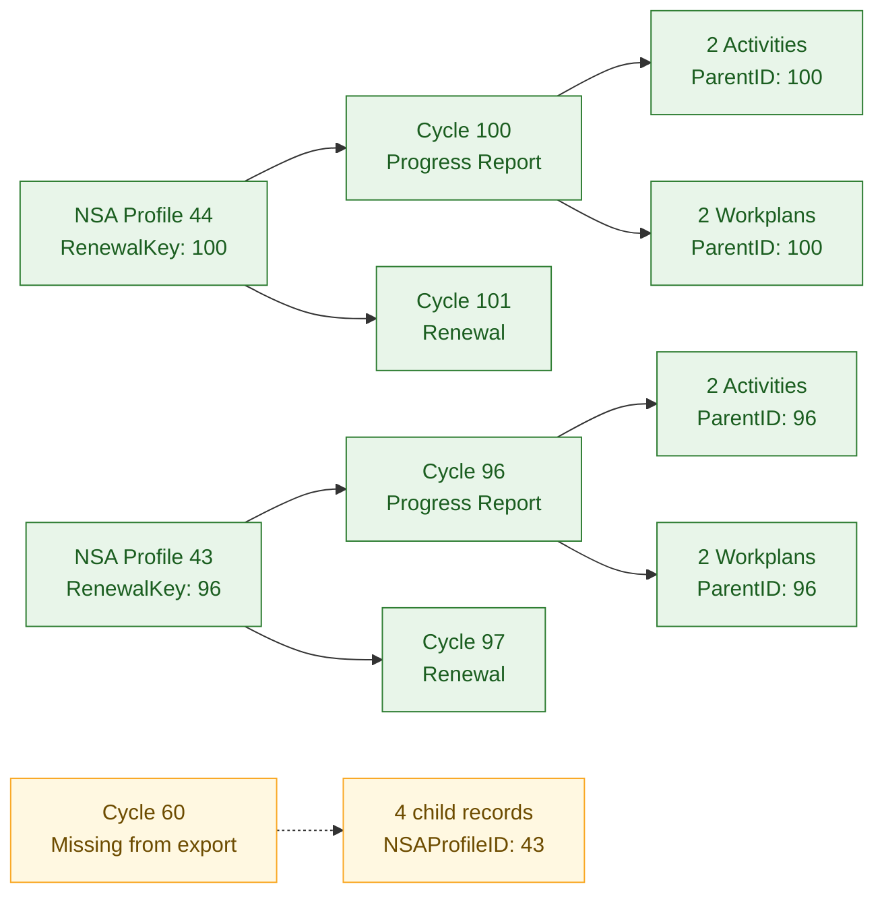

# Complete NSA Workflow Validation Report

**Environment:** DEV  
**Review date:** 2026-07-31  
**Evidence reviewed:** DEV CSV/JSON exports and the public-report data model  
**Overall result:** **Not yet complete — structural persistence partially passes; the indexing fix is not proven**



## Executive summary

The review covered the complete export and used `NSAProfileID = 44` and
`NSAProfileID = 43` as the detailed validation sample because they contain the
most complete combination of profile, previous cycle, progress report, renewal,
Activity, Workplan, and `RenewalKey` data.

Profile 44 demonstrates the expected persistence pattern: the organization ID
remains stable, cycles 100 and 101 are distinct, `RenewalKey = 100` identifies
the previous cycle, and all four child records point to cycle 100. Profile 43
also preserves the organization across cycles 96 and 97, with
`RenewalKey = 96`, but four additional children reference missing cycle 60.

Across the full export, 21 of 22 NSA cycle records link to a valid NSA Profile.
Where both parent and child records are available, no Activity or Workplan
points to a different organization.

The available evidence is not sufficient to confirm that the previous
indexing problem is resolved. It contains no physical SharePoint index
configuration, executed query evidence, list-threshold test, or response-time
measurements. The complete workflow also cannot yet pass because Extension is
not represented and four child records have no exported parent cycle.

## Validation results

| Check | Result | Evidence |
|---|---|---|
| Detailed validation sample | Selected | Profile IDs 44 and 43 contain the most complete lifecycle and relationship data |
| Profile 44 cycle persistence | Pass | Stable `NSAProfileID = 44`; cycles 100 and 101; `RenewalKey = 100` |
| Profile 44 child persistence | Pass | 2 Activities and 2 Workplans use `ParentID = 100`; 0 missing parents |
| Profile 43 cycle persistence | Pass | Stable `NSAProfileID = 43`; cycles 96 and 97; `RenewalKey = 96` |
| Profile 43 child persistence | Partial pass | 2 Activities and 2 Workplans link to cycle 96; 4 other children reference missing cycle 60 |
| Functional indexing regression case | Ready to execute | Profiles 44 and 43 allow checks by `RenewalKey`, `NSAProfileID`, cycle `ID`, and child `ParentID` |
| NSA Profile is the stable organization identity | Pass with exception | 21/22 NSAs have a valid `NSAProfileID`; `NSAs.ID = 41` is blank |
| NSA record is the cycle/submission identity | Pass | 22 unique `NSAs.ID` values; no duplicate cycle IDs |
| Activity belongs to the correct cycle | Partial pass | 12/14 have an exported `NSAs.ID` parent |
| Workplan belongs to the correct cycle | Partial pass | 32/34 have an exported `NSAs.ID` parent |
| Parent and child identify the same organization | Pass for verifiable records | 0 profile mismatches where the parent exists |
| New Application workflow represented | Partial | Records exist, but no documented end-to-end execution |
| Renewal workflow represented | Partial | Records exist, but no documented end-to-end execution |
| Progress Report workflow represented | Partial | Records exist, but no documented end-to-end execution |
| Extension workflow represented | Not tested | No Extension record in the supplied NSA export |
| Previous indexing defect cannot be reproduced | Not proven | No defect replay, query trace, index configuration, or timing evidence |

### Data exceptions

- `NSAs.ID = 41` has no `NSAProfileID`.
- Activities `NSA-2026-60-A_1` and `NSA-2026-60-A_2` reference
  `ParentID = 60`, but `NSAs.ID = 60` is absent from the export.
- Workplans `NSA-2026-60-WPA_1` and `NSA-2026-60-WPA_2` have the same missing
  parent. All four children identify `NSAProfileID = 43`, but their cycle
  persistence cannot be verified without the parent.

## Required persistence rule

```text
NSA Profiles.ID                 stable organization identity
  -> NSAs.NSAProfileID          one organization, one or more cycles

NSAs.ID                         unique submission/cycle identity
  -> Activity.ParentID          children for that exact cycle
  -> Workplan.ParentID

NSA Profiles.ID
  -> child.NSAProfileID         ownership cross-check, not a cycle join
```

For a renewal, extension, or other new cycle, `NSAProfileID` must remain the
same and a distinct `NSAs.ID` must identify the cycle. Each child must store
that `NSAs.ID` in `ParentID` and the same organization ID in `NSAProfileID`.

## Evidence needed to close the validation

1. Execute New Application, Renewal, Progress Report, and Extension in DEV and
   record the IDs created or updated in all four tables.
2. After every lifecycle transition, verify the profile, cycle, `ParentID`,
   `NSAProfileID`, status, and absence of unintended duplicates.
3. Replay the original indexing defect using the same filter/query and record
   expected versus actual behavior.
4. Capture the physical index configuration and the exact queries that use the
   indexed fields.
5. Repeat the queries above the relevant list-threshold/data volume and record
   response times, timeouts, and returned IDs against an agreed target.
6. Correct or explain `NSAs.ID = 41` and supply or remove the four children of
   missing `NSAs.ID = 60`.

## Acceptance decision

The table relationship design is correct, and the verifiable records are
consistent. However, the complete workflow and indexing objectives must remain
**open** until the missing scenarios, parent records, index configuration,
defect regression, and performance evidence are supplied. The package is not
ready for final ITS handover as a completed validation.
