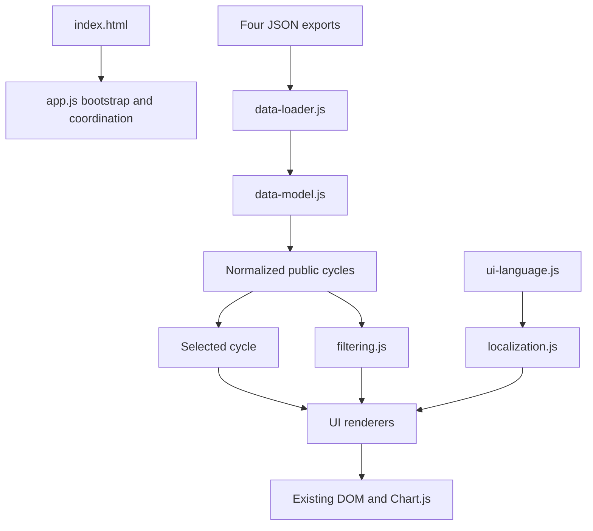
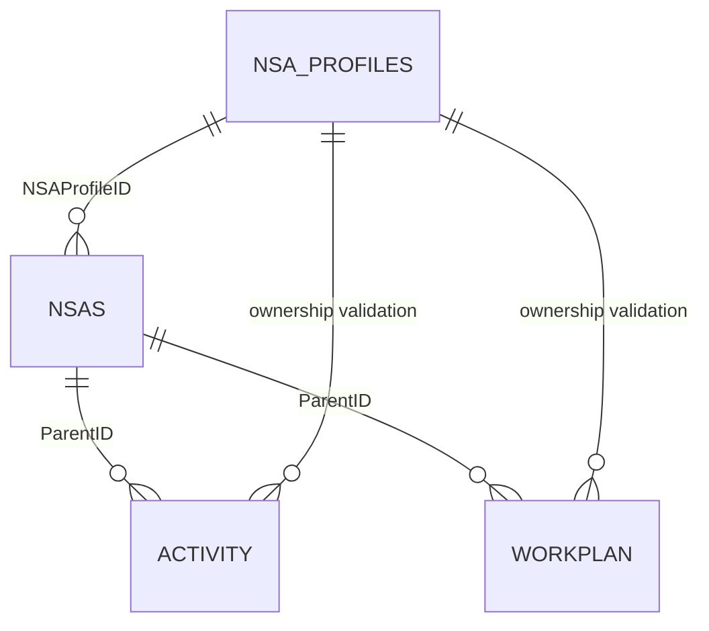

# Target Frontend Architecture After Refactoring

| Item | Value |
| --- | --- |
| Application | PAHO NSA public report viewer |
| Architecture | Static HTML/CSS with modular browser JavaScript |
| Data model | Four DEV JSON exports |
| Document date | 2026-08-04 |
| Status | **Target architecture; not yet the current production implementation** |

## Contents

1. [Objective](#objective)
2. [Scope and constraints](#scope-and-constraints)
3. [Architecture overview](#architecture-overview)
4. [Module responsibilities](#module-responsibilities)
5. [Runtime flow](#runtime-flow)
6. [Data model](#data-model)
7. [Relationships and integrity rules](#relationships-and-integrity-rules)
8. [Normalized cycle model](#normalized-cycle-model)
9. [Application state](#application-state)
10. [Filtering and selection](#filtering-and-selection)
11. [Rendering](#rendering)
12. [Localization](#localization)
13. [Loading and error states](#loading-and-error-states)
14. [Submission-type behavior](#submission-type-behavior)
15. [DOM and external dependencies](#dom-and-external-dependencies)
16. [Test architecture](#test-architecture)
17. [Changes from V1](#changes-from-v1)
18. [Implementation sequence](#implementation-sequence)
19. [Final architecture](#final-architecture)

## Objective

Define the frontend architecture expected after refactoring `assets/js/app.js`
for the four-list DEV data model. The target keeps the current static deployment
and visual layout while separating data rules, filtering, localization, and
rendering into testable JavaScript modules.

## Scope and constraints

- Keep the existing `index.html`, CSS, cards, filters, language controls,
  navigation, and Chart.js chart targets.
- Load static JSON files in the browser; there is no runtime database or API.
- Use native ES modules. No frontend framework is required.
- Keep `NSAs.ID` as the selected UI identity.
- Do not infer SharePoint persistence, physical indexing, or query performance
  from frontend behavior.
- Responsive-layout remediation is separate from the DEV data refactor.

## Architecture overview



`app.js` coordinates the flow. Data rules remain independent from the DOM, and
renderers receive normalized data instead of resolving raw relationships.

## Module responsibilities

The exact filenames may be introduced incrementally, but the responsibility
boundaries must be preserved.

| Module | Responsibility | Must not do |
| --- | --- | --- |
| `app.js` | Bootstrap, state updates, event registration, and render coordination | Implement joins, duplicate filter logic, or format exported fields inline |
| `data-loader.js` | Load the four JSON resources and report per-resource status | Convert failures silently into empty arrays |
| `data-model.js` | Normalize IDs, apply eligibility, join Profiles to cycles, select children, and validate ownership | Read or update the DOM |
| `filtering.js` | Build dynamic filter options, filter cycles, create cycle labels, and sort results | Maintain separate search and select-filter implementations |
| `localization.js` | Resolve localized export fields and their fallback order | Contain DOM-specific rendering |
| `formatting.js` | Escape plain text, preserve approved line breaks, validate URLs, and format numbers | Trust raw exported HTML by default |
| `renderers.js` or `renderers/` | Render status, Profile, collaboration, financial, Activity, Workplan, and search-result views | Recalculate data relationships |
| `ui-language.js` | Store English and Spanish UI labels, empty states, and error messages | Store relationship or eligibility rules |

If the renderers remain in one file initially, they should still receive
prepared view data. They can be split by card after behavior is covered by
tests.

## Runtime flow

1. `app.js` sets the UI to `loading`.
2. `data-loader.js` loads these resources in parallel:
   - `assets/database/nsa-profiles.json`
   - `assets/database/nsa.json`
   - `assets/database/activity.json`
   - `assets/database/workplan.json`
3. `data-model.js` normalizes identifiers and builds Profile and cycle indexes.
4. Submissions are filtered by public eligibility.
5. Each eligible submission is joined to its Profile and converted into one
   normalized public cycle.
6. Filter options are generated from the normalized public cycles.
7. The application selects a cycle by `NSAs.ID`.
8. Activities and Workplans are selected by `ParentID` and validated by
   `NSAProfileID` ownership.
9. Localization and formatting helpers prepare display values.
10. Renderers update the existing DOM and chart.
11. Any language, filter, search, reset, or cycle-selection event updates state
    and uses the same render path.

## Data model

### `nsa-profiles.json`

One record represents a stable organization.

Authoritative public fields include:

- `ID`
- `Title`
- `NSAOrganizationType`
- `NSAObjectives`
- `NSAWorkFields`
- `NSABoardMembers`
- `NSAOrganizationBodies`
- `NSAWebsite`
- `NSAYearOfEstablishment`
- `PAHO_Focal_Point`

### `nsa.json`

One record represents a submission or collaboration cycle.

Authoritative cycle fields include:

- `ID`
- `NSAProfileID`
- `NSA_Status`
- `GovBodies_Status`
- `CollaborationPeriod`
- financial values
- cycle-level collaboration summary values
- focal-point role values

`TypeOfSubmission`, `Status`, and `GovBodies_Outcome` are not used as the
durable public type or eligibility fields.

### `activity.json`

Activity records belong to a specific cycle through `ParentID`. Their
`NSAProfileID` validates organization ownership.

### `workplan.json`

Workplan records belong to a specific cycle through `ParentID`. Their
`NSAProfileID` validates organization ownership. Workplans also supply progress
report and Year 1, Year 2, and Year 3 result fields where applicable.

## Relationships and integrity rules



```text
NSA Profiles.ID
  -> NSAs.NSAProfileID

NSAs.ID
  -> Activity.ParentID
  -> Workplan.ParentID

NSA Profiles.ID
  -> Activity.NSAProfileID
  -> Workplan.NSAProfileID
```

Rules:

- `NSA Profiles.ID` is the organization identity.
- `NSAs.ID` is the cycle identity and the selected UI value.
- Child `ParentID` selects records for the exact cycle.
- Child `NSAProfileID` validates ownership; it never replaces `ParentID`.
- A submission without a matching Profile is excluded from the public model.
- A child with a missing parent or mismatched organization is isolated or
  excluded and is never assigned to another cycle.
- Public eligibility is `GovBodies_Status = Approved` or `Pending`.

## Normalized cycle model

Renderers and filters operate on one normalized object per eligible cycle. A
minimum shape is:

```js
{
  cycleId,                 // NSAs.ID
  profileId,               // NSA Profiles.ID / NSAs.NSAProfileID
  organizationName,        // NSA Profiles.Title
  organizationType,        // NSA Profiles.NSAOrganizationType
  currentSubmissionType,   // NSAs.NSA_Status
  collaborationPeriod,     // NSAs.CollaborationPeriod
  profile,                 // normalized Profile display fields
  cycle                    // required cycle-level display fields
}
```

Do not expose a normalized property named `TypeOfSubmission`; that name can be
confused with the legacy source field.

## Application state

The application keeps one explicit state object:

```js
{
  status: 'loading' | 'ready' | 'partial' | 'error',
  language: 'en' | 'es',
  selectedCycleId: string | null,
  filters: {
    term: '',
    currentSubmissionType: '',
    organizationType: '',
    collaborationPeriod: ''
  },
  publicCycles: [],
  resourceErrors: []
}
```

Chart instances may remain private to the financial renderer. DOM elements are
not stored in the data model.

## Filtering and selection

One pure function handles search and all select filters.

- Search matches the localized organization label.
- Type options come from `currentSubmissionType`.
- Organization Type options come from `organizationType`.
- Collaboration Period options come from `collaborationPeriod`.
- Options are unique and derived from eligible normalized cycles.
- Combined filters use the same function and ordering.
- Results are sorted using the active-language organization label.
- A result label contains organization name, current submission type, and
  collaboration period.
- The result value remains `cycleId` (`NSAs.ID`).
- Clear Filters resets state, controls, search text, results, navigation, and
  selected-cycle behavior together.

## Rendering

Renderers receive normalized cycle data and already-selected children.

| Renderer | Input |
| --- | --- |
| Status | application status and localized message |
| Search and filter options | filtered cycles and dynamic option values |
| Profile | normalized Profile and cycle fields |
| Collaboration | resolved Health Agenda and Strategic Plan values |
| Activities | validated Activity rows or Workplan progress rows |
| Workplans | validated Workplan rows |
| Financial | normalized financial values and fiscal year |

Security boundary:

- Escape every exported plain-text value before inserting it into HTML.
- Convert line breaks only after escaping.
- Validate website protocols and allow only supported schemes such as HTTP and
  HTTPS.
- If rich text is required, sanitize it with an explicit allowlist. Do not pass
  raw exported HTML directly to `innerHTML`.
- Use `textContent` when markup is unnecessary.

## Localization

`ui-language.js` remains the source for English and Spanish UI text.

Required behavior:

- All loading, error, empty, no-result, and fallback messages are translated.
- `year3` is available in both language objects.
- The language objects keep matching key sets.
- `document.documentElement.lang` changes with the selected language.
- Source values use one documented fallback order: requested localized value,
  authoritative base value, alternate localized value, then `-`.
- Sorting and cycle labels use the active-language organization label.
- Unused keys are removed only after checking both HTML and JavaScript usage.

## Loading and error states

The loader reports the status of each JSON resource. It never turns a failed
request into an unexplained empty dataset.

| State | UI behavior |
| --- | --- |
| `loading` | Disable dependent controls and show a localized loading message |
| `ready` | Enable controls and render the selected cycle |
| `partial` | Identify unavailable content and show a localized partial-data message |
| `error` | Show a localized load error and retry action; do not render misleading empty cards |
| valid empty result | Show the appropriate localized empty-state message |

Error messages may identify the failed resource but must not expose sensitive
internal information.

## Submission-type behavior

All branching uses `currentSubmissionType`, sourced from `NSAs.NSA_Status`.

| Current type | Activities | Workplan | Financial section |
| --- | --- | --- | --- |
| New Application | Activity records | Visible | Visible |
| Renewal | Activity records | Visible | Visible |
| Progress Report | Progress data from Workplan records | Hidden | Hidden |

Progress Report rendering includes available Year 1, Year 2, and Year 3
results. No Extension scenario is added without new source evidence.

## DOM and external dependencies

The refactor preserves the current DOM IDs and card structure in `index.html`.
Direct HTML changes are limited to:

- correcting label `for` attributes;
- keeping only the initial **All** option where JavaScript builds dynamic
  options;
- adding a status/error target only if no suitable existing target is present.

Runtime dependencies remain:

- four JSON files under `assets/database/`;
- `ui-language.js`;
- Chart.js for the financial chart;
- a static HTTP server for local and deployed use.

No CSS change is required for the data architecture. Mobile sidebar changes
remain a separate UI remediation.

## Test architecture

### Unit tests

Cover pure functions for:

- ID normalization;
- public eligibility;
- Profile-to-cycle normalization;
- cycle-to-child joins and ownership validation;
- localized field fallback;
- combined filtering, sorting, and cycle labels;
- safe text, line breaks, URL validation, and numeric formatting;
- Year 1, Year 2, and Year 3 result selection.

### Fixtures

- Use a controlled `Pending` cycle because the current exports contain none.
- Re-run Profiles 43, 44, and 46.
- Profiles 44 and 46 must pass.
- Profile 43 must remain **Pass with source-data exceptions**, and its orphan
  children must not enter a valid cycle.
- Keep the cycle with missing `NSAProfileID` unassigned to an organization.

### Browser smoke test

Verify loading, error display, cycle selection, combined filters, language
switching, reset, card visibility, navigation, chart replacement, and empty
states in a real browser.

## Changes from V1

| V1 architecture | Target architecture |
| --- | --- |
| Three JSON datasets | Four datasets, including `NSA Profiles` |
| NSA record treated as both organization and submission | Separate stable Profile and cycle identities |
| `Status === Completed` used as the entry rule | `GovBodies_Status = Approved` or `Pending` used for public eligibility |
| `TypeOfSubmission` used as the current type | `NSAs.NSA_Status` normalized as `currentSubmissionType` |
| Child records joined to the old NSA identifier | Children joined by `ParentID = NSAs.ID` and ownership checked by `NSAProfileID` |
| Hard-coded or partially generated filter options | All filter options generated from normalized public cycles |
| Multiple filter/search paths | One pure filtering pipeline |
| Failed JSON converted to an empty array | Explicit loading, partial, error, and empty states |
| Localized fallback repeated in renderers | One localized-value resolver |
| Partial escaping of exported values | One safe-rendering boundary |
| Year 1 and Year 2 rendering | Year 1, Year 2, and Year 3 rendering |
| Monolithic `app.js` | Coordinator plus pure data, filtering, localization, formatting, and rendering modules |

## Implementation sequence

1. Add unit tests for current joins, eligibility, filters, and localized values.
2. Extract ID normalization, eligibility, Profile/cycle normalization, and
   child selection into `data-model.js`.
3. Replace duplicate search/filter paths with `filtering.js`.
4. Add localization and formatting helpers, including Year 3 and safe output.
5. Move card rendering behind renderer functions that receive prepared data.
6. Reduce `app.js` to bootstrap, state, events, and render coordination.
7. Add loading, partial, error, retry, and complete reset behavior.
8. Run unit tests and the browser smoke test, including the controlled Pending
   fixture and Profiles 43, 44, and 46.

## Final architecture

The refactored viewer remains a static browser application. Its architecture
separates authoritative data rules from UI rendering, keeps cycle selection
specific to `NSAs.ID`, validates child ownership, centralizes filters and
localization, and applies one safe output policy. The existing HTML/CSS layout
and deployment model remain unchanged.
