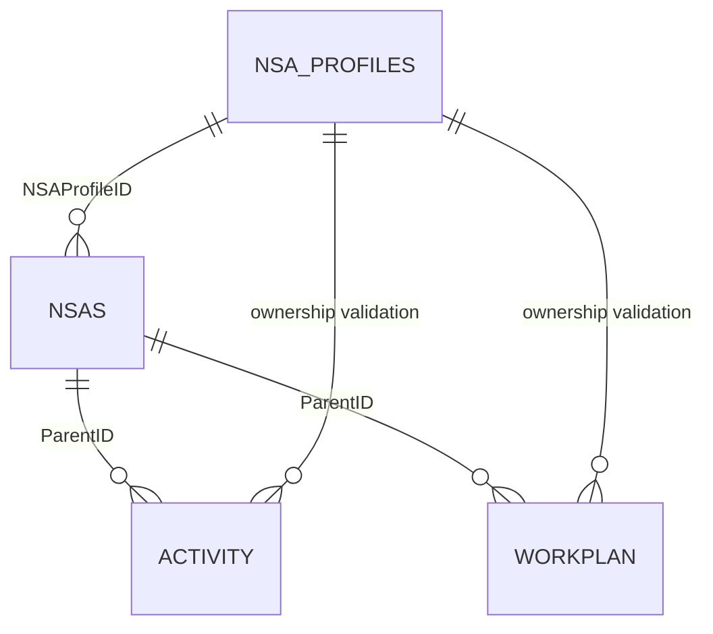

# Data Architecture and UI Integration — DEV Data Refactor

## Table of Contents

- [Quick Architecture Overview](#quick-architecture-overview)
- [Status](#status)
- [Scope and Purpose](#scope-and-purpose)
- [Runtime Flow](#runtime-flow)
- [Data Model](#data-model)
- [Relationships](#relationships)
- [Relationship Diagram](#relationship-diagram)
- [Behavioral Relationships Derived From Code](#behavioral-relationships-derived-from-code)
- [Sidebar Behavior](#sidebar-behavior)
- [Rendering Rules](#rendering-rules)
- [Collaboration Data Resolution](#collaboration-data-resolution)
- [Activities and Workplans](#activities-and-workplans)
- [Financial Chart](#financial-chart)
- [Language Behavior](#language-behavior)
- [DOM Dependencies](#dom-dependencies)
- [External Dependencies](#external-dependencies)
- [Maintenance Notes](#maintenance-notes)
- [Short Summary](#short-summary)

## Quick Architecture Overview

The refactored NSA viewer remains a static client-side application. It loads
four JSON files, builds one normalized public record per eligible NSA cycle,
applies filters, selects a cycle by `NSAs.ID`, and renders the existing Profile,
collaboration, financial, Activity, and Workplan cards.

The main architectural change is the separation of data rules from DOM
rendering. `app.js` coordinates startup, state, events, and rendering, while
focused functions in the same file handle loading, normalization, joins,
filtering, localization, and safe formatting.

## Status

- Branch reviewed: `main`
- Architecture status: planned behavior for the incremental refactor
- Current production controller: `assets/js/app.js`
- Data source type: four static JSON exports
- Runtime database: none
- Document date: 2026-08-05
- Layout decision: preserve the current HTML/CSS structure

This document describes the intended behavior after the refactor. It does not
require new JavaScript module files and must not be used as evidence that the
changes or tests already exist.

## Scope and Purpose

This document defines how the public viewer will use the DEV data structure
after the JavaScript refactor.

The scope includes:

- four-file loading and error handling;
- Profile, cycle, Activity, and Workplan relationships;
- public eligibility and authoritative report fields;
- application state, filtering, and cycle selection;
- rendering, localization, and safe output;
- function responsibilities and regression testing.

The scope does not include a framework migration, backend API, database,
SharePoint persistence, physical indexing, performance certification, or visual
redesign.

## Runtime Flow

### 1. Bootstrap

At startup, `app.js` sets the page to `loading` and requests these files in
parallel:

- `assets/database/nsa-profiles.json`
- `assets/database/nsa.json`
- `assets/database/activity.json`
- `assets/database/workplan.json`

The loader reports success or failure for each resource. A failed request is
not silently converted into an empty array.

### 2. Data preparation

After loading:

1. IDs are normalized as trimmed strings.
2. Profiles are indexed by `NSA Profiles.ID`.
3. Submissions are filtered by `GovBodies_Status`.
4. Eligible submissions are joined to Profiles through `NSAProfileID`.
5. One normalized public-cycle object is created per valid submission.
6. Filter options are derived from the normalized cycle collection.

### 3. Selection and rendering

1. The selected value is `NSAs.ID`.
2. Activities and Workplans are selected with `ParentID = NSAs.ID`.
3. Child `NSAProfileID` validates organization ownership.
4. Localized fields and fallbacks are resolved before rendering.
5. Renderers update the existing DOM and Chart.js target.

Search, filters, language changes, reset, and cycle selection all use the same
state-update and render path.

### 4. Current JavaScript files and responsibilities

| Existing file | Responsibility after refactoring |
| --- | --- |
| `assets/js/app.js` | Load data, normalize IDs, build public cycles, validate relationships, manage state and filters, resolve source-field fallbacks, format safe output, handle events, and coordinate rendering |
| `assets/js/ui-language.js` | Store English and Spanish UI labels and messages |
| `assets/js/vendors/chart.js` | Provide the existing financial chart dependency; no refactor required |

The refactor can introduce focused, testable functions inside `app.js`. No
additional internal JavaScript files are currently planned.

### 5. Main state

The application uses one explicit state object:

```js
{
  status: 'loading' | 'ready' | 'partial' | 'error',
  language: 'en' | 'es',
  selectedCycleId: string | null,
  filters: {
    term: '',
    currentSubmissionType: '',
    organizationType: '',
    collaborationPeriod: ''
  },
  publicCycles: [],
  resourceErrors: []
}
```

The financial renderer may keep its Chart.js instance privately so it can
destroy the previous chart before creating a replacement.

## Data Model

### 1. `nsa-profiles.json`

Each row represents a stable organization.

<details>
<summary>Required fields used by the public viewer</summary>


- `ID`
- `Title`
- `NSAOrganizationType`
- `NSAObjectives`
- `NSAWorkFields`
- `NSABoardMembers`
- `NSAOrganizationBodies`
- `NSAWebsite`
- `NSAYearOfEstablishment`
- `PAHO_Focal_Point`

</details>

### 2. `nsa.json`

Each row represents one submission or collaboration cycle.

<details>
<summary>Required fields used by the public viewer</summary>


```text
ID
NSAProfileID
NSA_Status
GovBodies_Status
CollaborationPeriod
NSAFocalpointRole
FinAnnualIncome
FinAnnualExpenses
FinAssets
FinAnnualIncomeYear
CollabActHealthAgenda
CollabActHealthAgenda_txtENG
CollabActHealthAgenda_txtSPA
CollabActStrategicPlan
CollabActStrategicPlan_txtENG
CollabActStrategicPlan_txtSPA
CollabWPActHealthAgenda
CollabWPActHealthAgenda_txtENG
CollabWPActHealthAgenda_txtSPA
CollabWPActStrategicPlan
CollabWPActStrategicPlan_txtENG
CollabWPActStrategicPlan_txtSPA
```

</details>

`NSA_Status` supplies the current Type of Submission.
`GovBodies_Status` supplies public eligibility.

Legacy `TypeOfSubmission`, workflow `Status`, and `GovBodies_Outcome` do not
replace these authoritative fields.

The current `assets/database/nsa.json` export does not contain the financial or
collaboration fields listed above. They remain part of the required frontend
contract and must be supplied by the export before those report sections can be
validated end to end.

### 3. `activity.json`

<details>
<summary>Required fields used by the public viewer</summary>


```text
ID
ActivityID
ParentID
NSAProfileID
Description
DescriptionENG
DescriptionSPA
DirectResults
DirectResultsENG
DirectResultsSPA
Entity
NSAFocalpoint
```

</details>

`ParentID` supplies the cycle relationship, and `NSAProfileID` validates
organization ownership. The base `Description` and `DirectResults` fields are
required fallbacks when localized values are blank.

### 4. `workplan.json`

<details>
<summary>Required fields used by the public viewer</summary>


```text
ID
Reference
ParentID
NSAProfileID
Description
DescriptionENG
DescriptionSPA
ExpectedResults
ExpectedResultsENG
ExpectedResultsSPA
ResponsibleEntity
HealthAgenda
HealthAgendaENG
HealthAgendaSPA
StrategicPlan
StrategicPlanENG
StrategicPlanSPA
ProgressReport
ProgressReportENG
ProgressReportSPA
Year1_Date
Year1_Results
Year1_ResultsENG
Year1_ResultsSPA
Year2_Date
Year2_Results
Year2_ResultsENG
Year2_ResultsSPA
Year3_Date
Year3_Results
Year3_ResultsENG
Year3_ResultsSPA
NSAFocalpoint
```

</details>

`ParentID` supplies the cycle relationship, and `NSAProfileID` validates
organization ownership. Base text and result fields provide fallbacks for blank
localized values.

### 5. Normalized public cycle

Filters and renderers operate on one object per eligible cycle:

```js
{
  cycleId,                 // NSAs.ID
  profileId,               // NSA Profiles.ID / NSAs.NSAProfileID
  organizationName,        // NSA Profiles.Title
  organizationType,        // NSA Profiles.NSAOrganizationType
  currentSubmissionType,   // NSAs.NSA_Status
  collaborationPeriod,     // NSAs.CollaborationPeriod
  profile,
  cycle
}
```

The normalized model does not expose the current type as
`TypeOfSubmission`; `currentSubmissionType` prevents confusion with the legacy
field.

## Relationships

### 1. Profile to cycles

```text
NSA Profiles.ID = NSAs.NSAProfileID
```

One organization may have multiple submission/collaboration cycles.

### 2. Cycle to Activities

```text
NSAs.ID = Activity.ParentID
```

### 3. Cycle to Workplans

```text
NSAs.ID = Workplan.ParentID
```

### 4. Ownership validation

```text
NSA Profiles.ID = Activity.NSAProfileID
NSA Profiles.ID = Workplan.NSAProfileID
```

`ParentID` selects the exact cycle. Child `NSAProfileID` only validates that the
child belongs to the same organization; it never replaces `ParentID`.

## Relationship Diagram



```text
                 +-------------------------+
                 |      NSA Profiles       |
                 | PK: ID                  |
                 | Title                   |
                 | NSAOrganizationType     |
                 +------------+------------+
                              |
                              | 1:N through NSAProfileID
                              v
                 +-------------------------+
                 |          NSAs           |
                 | PK: ID                  |
                 | FK: NSAProfileID        |
                 | NSA_Status              |
                 | GovBodies_Status        |
                 | CollaborationPeriod     |
                 +------------+------------+
                              |
                    1:N through ParentID
                   +----------+----------+
                   |                     |
                   v                     v
          +----------------+    +----------------+
          |    Activity    |    |    Workplan    |
          | FK: ParentID   |    | FK: ParentID   |
          | NSAProfileID   |    | NSAProfileID   |
          +----------------+    +----------------+
```

## Behavioral Relationships Derived From Code

### 1. Public eligibility

Only cycles with either of these durable values enter the public model:

```text
GovBodies_Status = Approved
GovBodies_Status = Pending
```

The current exports contain no Pending cycle, so this path requires a controlled
test fixture.

### 2. Valid organization requirement

An eligible cycle must have a matching `NSA Profiles` record. A cycle without a
valid `NSAProfileID` remains unassigned and is excluded from the public model.

### 3. Child integrity

A child is rendered only when:

- its `ParentID` matches the selected `NSAs.ID`; and
- its `NSAProfileID`, when available, matches the selected cycle's Profile.

Missing-parent and mismatched children are isolated or excluded. They are never
assigned to another valid cycle.

### 4. Multiple cycles

Cycles that share the same organization remain separate. Selection, child
joins, card visibility, and labels use the selected `NSAs.ID`.

## Sidebar Behavior

### Search

One pure filtering function handles text search and all select filters.

- Search uses the active-language organization label.
- Results are sorted using that same label.
- A result identifies the organization, current submission type, and
  collaboration period.
- The result value is `cycleId` (`NSAs.ID`).
- Search results and select filters use the same ordering and result limit.

### Filter options

Options are unique and generated from eligible normalized cycles:

- Type of Submission: `currentSubmissionType` from `NSAs.NSA_Status`;
- Organization Type: `NSA Profiles.NSAOrganizationType`;
- Collaboration Period: `NSAs.CollaborationPeriod`.

### Clear Filters

Reset clears:

- internal filter state;
- search text and results;
- all select values;
- navigation visibility;
- selected-cycle state according to one defined reset rule.

## Rendering Rules

### 1. Render coordination

`app.js` selects the normalized cycle and validated children, then calls the
renderers. Renderers do not perform joins or maintain independent filters.

### 2. Profile rendering

Stable organization fields come from `NSA Profiles`. Current type,
collaboration period, financial values, and cycle-specific collaboration fields
come from the selected `NSAs` record.

### 3. Safe output

- Escape all exported plain text before inserting it into HTML.
- Convert line breaks only after escaping.
- Use `textContent` where markup is unnecessary.
- Accept only supported website protocols such as HTTP and HTTPS.
- Sanitize supported rich text with an explicit allowlist; do not insert raw
  exported HTML directly.

### 4. Visible UI states

| State | Rendering behavior |
| --- | --- |
| `loading` | Disable dependent controls and show a localized loading message |
| `ready` | Enable controls and render the selected cycle |
| `partial` | Identify unavailable content and show a localized partial-data message |
| `error` | Show a localized load error and retry action |
| valid empty result | Show the relevant localized empty-state message |

Loading failures must not look like valid empty data.

## Collaboration Data Resolution

Collaboration values are resolved before rendering through one localized-value
helper.

### Progress Report

Health Agenda precedence:

1. cycle Workplan collaboration value;
2. localized cycle Workplan text;
3. related Workplan localized value.

Strategic Plan precedence:

1. cycle Workplan strategic value;
2. localized cycle Workplan strategic text;
3. related Workplan localized value.

### New Application and Renewal

Health Agenda precedence:

1. cycle Activity collaboration value;
2. localized cycle Activity text;
3. cycle Workplan collaboration value;
4. related Workplan localized value.

Strategic Plan precedence:

1. cycle Activity strategic value;
2. localized cycle Activity strategic text;
3. cycle Workplan strategic value;
4. related Workplan localized value.

Selected strings, arrays, and lookup objects are normalized to one list shape
before rendering.

## Activities and Workplans

### Standard Activities

New Application and Renewal cycles render validated `activity.json` rows:

- localized description with base-field fallback;
- localized direct results with base-field fallback;
- responsible entity.

### Progress Report Activities

Progress Report cycles use validated `workplan.json` rows for current progress:

- localized description;
- localized progress-report result;
- responsible entity;
- available Year 1, Year 2, and Year 3 results.

### Workplans

New Application and Renewal cycles render validated `workplan.json` rows:

- localized description with fallback;
- localized expected results with fallback;
- responsible entity.

The prospective Workplan card is hidden for Progress Report cycles. No
Extension scenario is added without new source evidence.

## Financial Chart

The financial renderer uses the selected cycle's:

- `FinAnnualIncome`;
- `FinAnnualExpenses`;
- `FinAssets`;
- `FinAnnualIncomeYear`.

Behavior:

- normalize and format numeric values through shared helpers;
- destroy the previous Chart.js instance before replacement;
- show a localized empty message when all financial values are absent;
- hide the financial card and navigation for Progress Report cycles.

## Language Behavior

`ui-language.js` remains the source for English and Spanish UI text.

- Both language objects keep matching key sets.
- Loading, error, empty, no-result, and fallback messages are translated.
- `year3` is added in both languages.
- `document.documentElement.lang` follows the selected language.
- Source fields use one fallback order: requested localized field,
  authoritative base field, alternate localized field, then `-`.
- Language changes re-render labels, values, sorting, result labels, messages,
  and the brand logo.

Unused translation keys are removed only after checking both HTML and
JavaScript consumers.

## DOM Dependencies

The refactor preserves the current `index.html` structure and existing IDs,
including:

- `searchInput`
- `search-results`
- `period-select`
- `typeOfSubmission-type-input`
- `organization-type-input`
- `clear-filters`
- `nsa-title`
- `nsa-subtitle`
- `nsa-info`
- `nsa-activities`
- `workplans`
- `workplans-card`
- `financial_card`
- `financialBarChart`
- `FinAnnualIncomeYear`
- `collabWPActHealthAgendaObj`
- `strategicPlan`
- `card03`
- `card04`

Direct HTML changes are limited to:

- correcting label `for` attributes;
- retaining only **All** where JavaScript creates dynamic options;
- adding a status/error target if no existing element is suitable.

## External Dependencies

The target frontend depends on:

- `ui-language.js` for translated UI text;
- Chart.js for the financial chart;
- four static JSON files under `assets/database/`;
- a static HTTP server for local and deployed use.

No new JavaScript module files, framework, build system, runtime database, or
backend service is required.

## Maintenance Notes

### Changes from V1

| V1 | Refactored target |
| --- | --- |
| Three JSON datasets | Four datasets, including `NSA Profiles` |
| NSA record used as organization and submission | Separate Profile and cycle identities |
| `Status === Completed` entry rule | Public eligibility from `GovBodies_Status` |
| Current type from `TypeOfSubmission` | Current type from `NSAs.NSA_Status` |
| Children joined to the old NSA identifier | Children joined by `ParentID = NSAs.ID` |
| Hard-coded or partial filter options | Options generated from normalized public cycles |
| Multiple filter/search paths | One filtering pipeline |
| Failed JSON treated as empty | Explicit loading, partial, error, and empty states |
| Localized fallback repeated in renderers | One localized-value resolver |
| Partial escaping | One safe-output boundary |
| Year 1 and Year 2 results | Year 1, Year 2, and Year 3 results |
| Monolithic controller | Existing controller organized around focused, testable functions |

### Implementation order

1. Add unit tests for joins, eligibility, filters, and localized values.
2. Extract ID normalization, eligibility, Profile/cycle normalization, and
   child selection.
3. Consolidate search and filtering.
4. Add localization, formatting, Year 3, and safe-output helpers.
5. Move card rendering behind renderer functions that receive prepared data.
6. Reduce `app.js` to bootstrap, state, events, and render coordination.
7. Add loading, partial, error, retry, and complete reset behavior.
8. Run unit tests and a browser smoke test.

### Regression coverage

- Test Pending eligibility with a controlled fixture.
- Re-run Profiles 43, 44, and 46.
- Profiles 44 and 46 must pass.
- Profile 43 must remain **Pass with source-data exceptions**, with orphan
  children excluded from valid cycles.
- Keep the cycle with missing `NSAProfileID` unassigned.
- Test search, combined filters, cycle selection, language switching, reset,
  card visibility, chart replacement, loading failures, and empty states.

### Deployment and evidence limits

- Keep the static deployment model.
- Do not add a build system unless a concrete implementation need appears.
- Do not claim SharePoint persistence, physical indexing, or performance from
  frontend or JSON tests.
- Keep mobile/sidebar remediation separate from the data refactor.

## Short Summary

The refactored viewer keeps the current page, JavaScript files, and deployment
model but uses four datasets and separate organization and cycle identities.
Focused functions inside `app.js` handle loading, normalization, relationships,
filtering, localization, formatting, and rendering. Children remain specific to
`NSAs.ID`, public eligibility uses `GovBodies_Status`, current type uses
`NSA_Status`, and all exported content crosses one safe rendering boundary.
