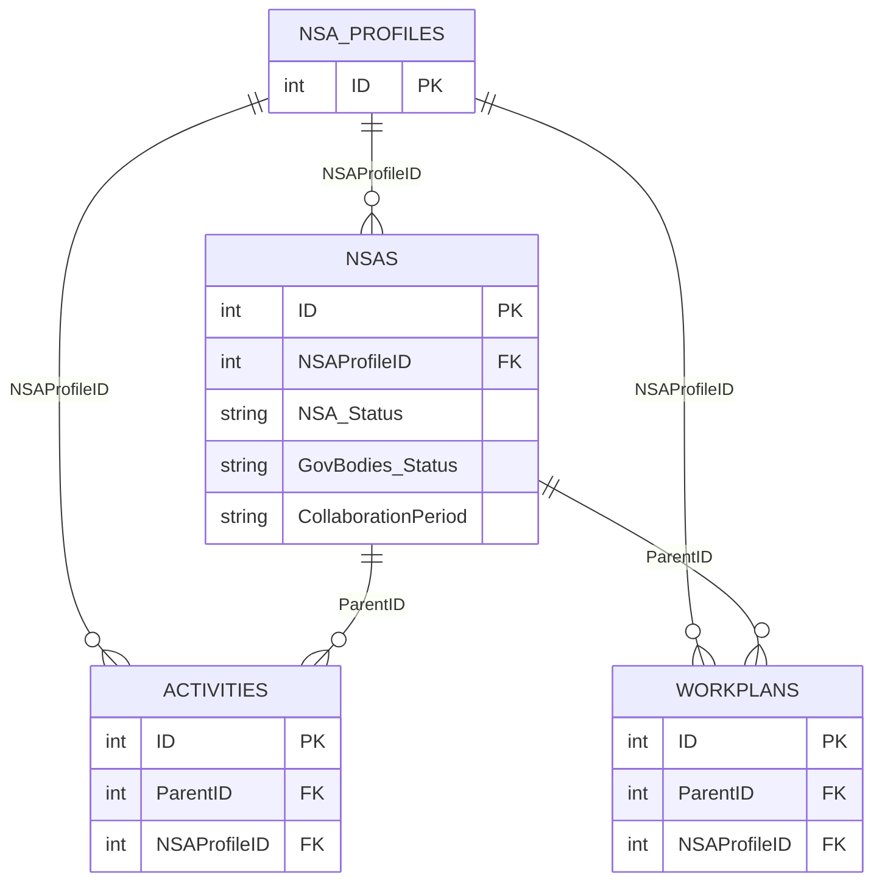

# Frontend Changes for the DEV Data Structure

## Objective

Document the frontend changes required to migrate the V1 behavior described in
[`architecture.md`](architecture.md) to the four-list DEV structure validated
in [`validate-dev-database-changes.md`](validate-dev-database-changes.md), while
preserving the current layout and user experience.

## Conclusion first

The frontend stack and page layout do not need to change. The refactoring is
primarily in `assets/js/app.js`, where the single V1 NSA model must become a
joined view of `NSA Profiles`, `NSAs`, Activities, and Workplans.

The HTML requires only minor filter cleanup. The CSS, cards, navigation,
language switcher, charts, and responsive layout can remain unchanged.

## V1 compared with the DEV structure

| Concern | V1 in `architecture.md` | DEV target |
| --- | --- | --- |
| JSON sources | `nsa`, `activity`, `workplan` | Add `nsa-profiles` as the fourth source |
| Organization and submission | Combined in one NSA row | Separate organization Profile from submission cycle |
| Organization identity | NSA row ID | `NSA Profiles.ID` |
| Cycle identity | NSA row ID | `NSAs.ID` |
| Organization-to-cycle join | Not required | `NSA Profiles.ID = NSAs.NSAProfileID` |
| Child-to-cycle join | `ParentID = nsa.id` | `ParentID = NSAs.ID` |
| Public eligibility | `Status = Completed` | `GovBodies_Status = Pending` or `Approved` |
| Current submission type | `TypeOfSubmission` | `NSAs.NSA_Status` |
| Organization type and details | NSA row | `NSA Profiles` |

## Target frontend model



`NSAProfileID` identifies the organization. `NSAs.ID` identifies the exact
submission cycle. The selected UI record must remain the cycle ID so that
Activities and Workplans continue to resolve through `ParentID`.

## Changes required in `assets/js/app.js`

### 1. Load and index the fourth dataset

Load `nsa-profiles.json` with the existing three JSON files and create a lookup
map keyed by `NSA Profiles.ID`.

```js
const profilesById = new Map(
  profiles.map((profile) => [String(profile.ID), profile]),
)
```

### 2. Replace the V1 eligibility filter

Remove the V1 dependency on `Status === 'Completed'`. Build the public cycle
collection with the rule defined by the reference document:

```js
const isPublicCycle = (cycle) =>
  ['Pending', 'Approved'].includes(cycle.GovBodies_Status)
```

Do not use `Status`, `GovBodies_Outcome`, or
`ActivitiesExtractionCompleted` for public eligibility.

### 3. Join each cycle to its organization Profile

For every eligible `NSAs` record, locate its organization through
`cycle.NSAProfileID`. The joined view model should keep both identities:

- `profile.ID`: stable organization ID;
- `cycle.ID`: submission/collaboration-cycle ID.

Do not merge them into one generic `id`. Keep `currentId` as `cycle.ID` or
rename it to `currentCycleId` to make its purpose explicit.

### 4. Move fields to their authoritative source

Update the existing render model according to this mapping:

| Current frontend use | DEV source |
| --- | --- |
| Organization title | `NSA Profiles.Title` |
| Objectives and work fields | `NSA Profiles` |
| Board members and organization bodies | `NSA Profiles` |
| Website and establishment year | `NSA Profiles` |
| Organization type | `NSA Profiles.NSAOrganizationType` |
| PAHO focal point | `NSA Profiles.PAHO_Focal_Point` |
| Current Type of Submission | `NSAs.NSA_Status` |
| Collaboration period | `NSAs.CollaborationPeriod` |
| Governing Bodies decision | `NSAs.GovBodies_Status` |
| Financial and cycle-specific fields | `NSAs` |

`NSA Profiles` is the source of truth for organization data. Missing Profile
joins should be treated as data errors rather than hidden with stale values
from an `NSAs` cycle.

### 5. Replace `TypeOfSubmission` reads with `NSA_Status`

Use `NSA_Status` for:

- the Type of Submission filter;
- the page subtitle and profile detail;
- New Application, Renewal, and Progress Report branching;
- financial, workplan, disclaimer, and collaboration visibility rules.

The user-facing label remains **Type of Submission**. The V1
`TypeOfSubmission` field must not be used as a fallback because it can retain
the original value after a cycle changes to Progress Report.

### 6. Preserve and validate child relationships

Continue retrieving children by the selected cycle:

```js
const activities = activity.filter(
  (row) => String(row.ParentID) === String(currentCycleId),
)

const workplans = workplan.filter(
  (row) => String(row.ParentID) === String(currentCycleId),
)
```

Also verify that each child's `NSAProfileID` matches the selected cycle's
`NSAProfileID`. A child with a missing parent or different organization must
not be assigned to another cycle.

### 7. Keep multiple cycles distinguishable

One organization can have several eligible `NSAs` cycles. The search can keep
the current interaction, but each result should identify the cycle:

```text
Organization name - NSA_Status - CollaborationPeriod
```

Clicking the result must select `NSAs.ID`, not `NSA Profiles.ID`.

### 8. Rebuild filter values from the joined model

- Type of Submission: unique eligible `NSAs.NSA_Status` values;
- Organization Type: unique
  `NSA Profiles.NSAOrganizationType` values;
- Collaboration Period: unique `NSAs.CollaborationPeriod` values.

`RenewalKey` remains a backend field and must not be displayed or used as a
frontend join.

## Changes required in `index.html`

No card, section, navigation, or layout change is required.

Only the filter markup needs cleanup:

1. Keep a single **All** option in the Type of Submission select and let
   `app.js` populate the remaining options from `NSA_Status`.
2. Keep a single **All** option in the Organization Type select and let
   `app.js` populate the remaining options from `NSA Profiles`.
3. Correct each label's `for` attribute so it points to its own select:
   - Type of Submission -> `typeOfSubmission-type-input`;
   - Collaboration Period -> `period-select`;
   - Organization Type -> `organization-type-input`.
4. Keep the existing result list, profile cards, financial card, collaboration
   card, and workplan card.

Renaming the internal Type of Submission element IDs is optional. The visible
label is still correct; the important change is that its values come from
`NSA_Status`.

## Files that do not require structural changes

| File or layer | Impact |
| --- | --- |
| `assets/css/*.css` | No change; preserve the current layout and responsive behavior |
| `assets/js/ui-language.js` | No required text change; **Type of Submission** remains the UI label |
| Chart.js and financial chart | Keep; continue reading financial values from the selected `NSAs` cycle |
| `server.js` | No change |

If the longer search-result labels wrap poorly, CSS may receive a small
presentation adjustment, but no layout refactoring is required.

## Acceptance criteria

- The page loads all four JSON files.
- Only cycles with `GovBodies_Status = Pending` or `Approved` enter the public
  view.
- Organization content comes from the matching `NSA Profiles` record.
- Type filters and conditional rendering use `NSA_Status`.
- Activities and Workplans use `ParentID = selected NSAs.ID`.
- Child `NSAProfileID` matches the selected organization.
- Multiple cycles for one organization remain distinct in search and filters.
- Missing relationships do not create cross-cycle associations.
- The existing HTML layout, CSS, language behavior, navigation, and charts
  remain visually unchanged.

## Final assessment

The migration does not require a new frontend stack or a redesigned page. It
requires a controlled refactor of the V1 data-loading and view-model logic in
`assets/js/app.js`, plus minor cleanup of the existing filter markup in
`index.html`.
