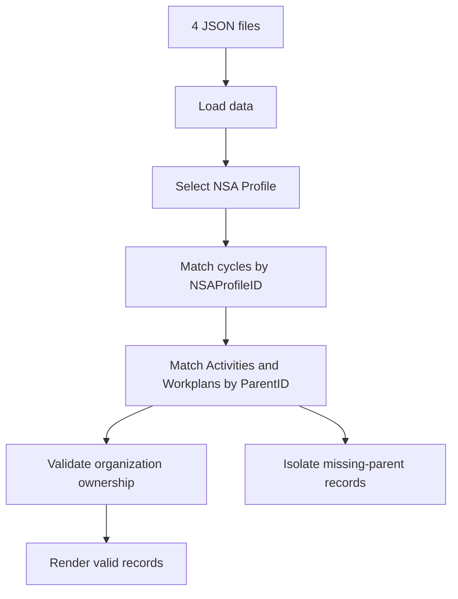

# End-to-End Data Workflow Validation Report

| Item            | Value                                      |
| --------------- | ------------------------------------------ |
| Application     | NSA relationship viewer                    |
| Environment     | Local DEV build using DEV JSON exports     |
| Validation date | 2026-08-01                                 |
| Result          | **Pass with source-data exceptions**       |

## Contents

1. [Objective](#objective)
2. [Executive summary](#executive-summary)
3. [Validated data flow](#validated-data-flow)
   - [Expected relationships](#expected-relationships)
4. [Test execution](#test-execution)
   - [Profile selection rationale](#profile-selection-rationale)
   - [Scenario coverage](#scenario-coverage)
   - [Loading results](#loading-results)
   - [Profile-to-interface results](#profile-to-interface-results)
5. [NSA indexing/association regression](#nsa-indexingassociation-regression)
6. [Field behavior reaching the interface](#field-behavior-reaching-the-interface)
7. [Integrity controls](#integrity-controls)
8. [Source-data exceptions](#source-data-exceptions)
9. [Conclusion](#conclusion)

## Objective

Validate that the complete workflow captures and processes data correctly for
the scenarios represented in the current DEV exports. Document the validation
results and hand them over to ITS.

## Executive summary

This report validates the complete path followed by the data in the application,
from the four JSON files to the rendered interface. The reference document
[`NSA.Tool.Data.Structure.for.Public.Report.pdf`](../NSAv2_starter_web_frontier/NSA.Tool.Data.Structure.for.Public.Report.pdf)
defines the expected relationships and field roles; the evidence below comes
from the JavaScript and JSON files at the tested commit.

The end-to-end application flow passed for Profiles 43, 44, and 46:

- NSAs were related to the selected organization by `NSAProfileID`.
- Activities and Workplans were related to the exact NSA cycle by `ParentID`.
- The current implementation kept children from different cycles separate.
- The expected cycles and children reached the interface.
- No duplicate IDs, duplicate references, or cross-organization mismatches were
  found.

Incomplete source records were isolated instead of being assigned to valid
cycles. Details are documented in [Source-data exceptions](#source-data-exceptions).

## Validated data flow

### Expected relationships

The application implements the expected relationships as follows:

| Expected relationship                  | JavaScript behavior                                                   | Result                                                  |
| -------------------------------------- | --------------------------------------------------------------------- | ------------------------------------------------------- |
| `NSA Profiles.ID = NSAs.NSAProfileID`  | Filters NSAs by the selected Profile ID                               | Pass                                                    |
| `NSAs.ID = Activity.ParentID`          | Builds the selected cycle-ID set and filters Activities by `ParentID` | Pass for Profiles 44 and 46 and for Profile 43 cycle 96 |
| `NSAs.ID = Workplan.ParentID`          | Builds the selected cycle-ID set and filters Workplans by `ParentID`  | Pass for Profiles 44 and 46 and for Profile 43 cycle 96 |
| `NSA Profiles.ID = child.NSAProfileID` | Checks that each rendered child belongs to the selected organization  | Pass for all verifiable records                         |

The implementation correctly uses `NSAProfileID` for organization-level
selection and `ParentID` for cycle-level selection. It does not substitute one
relationship for the other.

## Test execution

The application PoC was validated using the four current JSON files, covering
data loading, relationship processing, and interface rendering.

### Profile selection rationale

Profiles 43, 44, and 46 were selected because they are the profiles in the
current dataset with at least one cycle approved for the public report. They
also provide representative multi-cycle data, valid Activity and Workplan
relationships, and, through Profile 43, a missing-parent exception.

### Scenario coverage

Scenarios are identified by `TypeOfSubmission`, while `NSA_Status` represents
the cycle's current type in the interface.

| Scenario | Profile 43 | Profile 44 | Profile 46 | Result |
| --- | --- | --- | --- | --- |
| New application | Cycle 96 | Cycle 100 | Cycles 94 and 99 | Pass |
| Renewal | Cycle 97 | Cycle 101 | Cycles 95 and 98 | Pass |

### Loading results

| Resource            | Parsed records |
| ------------------- | -------------: |
| `nsa-profiles.json` |             46 |
| `nsa.json`          |             22 |
| `activity.json`     |             14 |
| `workplan.json`     |             34 |

The test confirmed that all four JSON datasets were parsed and that the
interface reported successful data loading.

### Profile-to-interface results

| Profile | Cycles rendered | Activities rendered with a parent | Workplans rendered with a parent | Orphans shown separately | Result                          |
| ------: | --------------: | --------------------------------: | -------------------------------: | -----------------------: | ------------------------------- |
|      43 |               2 |                                 2 |                                2 |                        4 | Pass with source-data exceptions |
|      44 |               2 |                                 2 |                                2 |                        0 | Pass                            |
|      46 |               4 |                                 2 |                                6 |                        0 | Pass                            |

#### Profile 43

- Cycles 96 and 97 reached the cycle table.
- Activities 42 and 43 and Workplans 73 and 74 reached cycle 96.
- Activities 38 and 39 and Workplans 60 and 61 did not enter cycle 96 because
  their `ParentID` is 60.
- The four records were preserved and displayed in the missing-parent section.

#### Profile 44

- The application selected Profile 44 by default.
- Cycles 100 and 101 reached the cycle table.
- Activities 45 and 46 and Workplans 79 and 80 reached cycle 100.
- No orphan section was displayed.

#### Profile 46

- Cycles 94, 95, 98, and 99 reached the cycle table.
- Activities 41 and 44 reached their respective cycles.
- Workplans 71, 72, 75, 76, 77, and 78 reached their respective cycles.
- No orphan section was displayed.

## NSA indexing/association regression

The correction is present in the current JavaScript:

1. It first finds every NSA cycle whose `NSAProfileID` matches the selected
   organization.
2. It creates a set containing the matching `NSAs.ID` values.
3. It retrieves Activities and Workplans only when their `ParentID` exists in
   that cycle-ID set.
4. It validates the child's `NSAProfileID` against the selected organization.
5. Children that match the organization but reference an absent cycle are
   isolated as orphans instead of being assigned to another cycle.

This prevents organization and cycle IDs from being confused or records from
different cycles from being mixed. The regression passed for Profiles 43, 44,
and 46 within the application/PoC scope. SharePoint index configuration and
query performance were not tested.

## Field behavior reaching the interface

The JavaScript follows the PDF guidance for the report-facing fields:

- The cycle table displays the current type from `NSA_Status`.
- `TypeOfSubmission` is not used as the current type filter.
- Eligibility is calculated only from `GovBodies_Status`, accepting Pending or
  Approved.
- `Status` is displayed as workflow progress and is not used for eligibility.
- `RenewalKey` is not exposed in the interface.

## Integrity controls

| Control | Result | Evidence |
| --- | --- | --- |
| Duplicate IDs or references | Pass | No duplicates in the four datasets |
| Parent/child organization integrity | Pass | No mismatches where both IDs are available |
| Cycle assignment and rendering | Pass | Valid records reached the interface; missing parents were isolated |

## Source-data exceptions

| Source-data exception | Impact |
| --- | --- |
| `NSAs.ID = 60` is missing | Profile 43 Activities 38 and 39 and Workplans 60 and 61 were isolated because their `ParentID` is 60 |
| NSA 41 and Workplan 44 have no `NSAProfileID` | The related records cannot be assigned to an organization |

These are source-data limitations; the application preserved or isolated the
affected records without creating incorrect associations.

## Conclusion

The application demo provides a successful **Proof of Concept
(PoC)** for the corrected end-to-end relationships. Profiles 44 and 46 passed
100% of the application checks, and Profile 43 passed for its valid cycle. The
overall result is **Pass with source-data exceptions** within the
application/PoC scope. This does not certify SharePoint's physical index
configuration or internal write operations.
