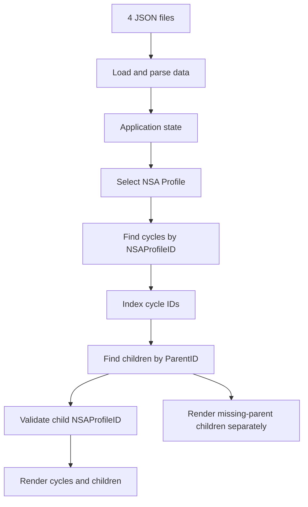

# End-to-End Data Workflow Validation Report

| Item            | Value                                  |
| --------------- | -------------------------------------- |
| Application     | NSA relationship viewer                |
| Environment     | Local DEV build using DEV JSON exports |
| Validation date | 2026-08-01                             |
| Result          | **Pass with source-data exceptions**   |
| Handover        | **Ready for ITS review**               |

## Contents

1. [Objective](#objective)
2. [Executive summary](#executive-summary)
3. [Validated application flow](#validated-application-flow)
   - [Expected relationships](#expected-relationships)
4. [Test execution](#test-execution)
   - [Loading results](#loading-results)
   - [Profile-to-interface results](#profile-to-interface-results)
     - [Profile 43](#profile-43)
     - [Profile 44](#profile-44)
     - [Profile 46](#profile-46)
5. [NSA indexing/association regression](#nsa-indexingassociation-regression)
6. [Field behavior reaching the interface](#field-behavior-reaching-the-interface)
7. [Integrity controls](#integrity-controls)
8. [Source-data exceptions](#source-data-exceptions)
9. [Acceptance and handover](#acceptance-and-handover)

## Objective

Validate that the complete workflow captures and processes data correctly
across all supported scenarios, including new applications, renewals, and
extensions. Document the validation results and hand them over to ITS.

The DEV data structure and relationship model are documented separately in
`validate-dev-database-changes.md` or `dev-data-structure-validation-report.md`. This
report focuses on validating their end-to-end use by the application, from
data loading and relationship processing through scenario handling and
interface rendering.

[Back to top](#top)

## Executive summary

This report validates the complete path followed by the data in the application,
from the four JSON files to the rendered interface. The PDF is used only to
define the expected relationships and field roles; the evidence below comes
from executing the current JavaScript with the current JSON files.

The end-to-end application flow passed for Profiles 43, 44, and 46:

- NSAs were related to the selected organization by `NSAProfileID`.
- Activities and Workplans were related to the exact NSA cycle by `ParentID`.
- The current implementation kept children from different cycles separate.
- The expected cycles and children reached the interface.
- No duplicate IDs, duplicate references, or cross-organization mismatches were
  found.

The application also handled incomplete source data without mixing it into a
valid cycle. Four Profile 43 children whose parent cycle 60 is missing were
shown separately as orphans. One additional NSA/Workplan chain cannot be shown
under an organization because both records lack `NSAProfileID`.

## Validated application flow

### Expected relationships

The PDF defines the expected joins. The application implements them as follows:

| Expected relationship                  | JavaScript behavior                                                   | Result                                                  |
| -------------------------------------- | --------------------------------------------------------------------- | ------------------------------------------------------- |
| `NSA Profiles.ID = NSAs.NSAProfileID`  | Filters NSAs by the selected Profile ID                               | Pass                                                    |
| `NSAs.ID = Activity.ParentID`          | Builds the selected cycle-ID set and filters Activities by `ParentID` | Pass for Profiles 44 and 46 and for Profile 43 cycle 96 |
| `NSAs.ID = Workplan.ParentID`          | Builds the selected cycle-ID set and filters Workplans by `ParentID`  | Pass for Profiles 44 and 46 and for Profile 43 cycle 96 |
| `NSA Profiles.ID = child.NSAProfileID` | Checks that each rendered child belongs to the selected organization  | Pass for all verifiable records                         |

The implementation correctly uses `NSAProfileID` for organization-level
selection and `ParentID` for cycle-level selection. It does not substitute one
relationship for the other.

Profiles 44 and 46 pass all relationship checks. The valid Profile 43 chain
through cycle 96 also passes. Profile 43 remains a partial result only because
Activities 38 and 39 and Workplans 60 and 61 reference missing cycle 60; these
source-data exceptions are documented separately below.

## Test execution

The validation executed the actual `index.js` with a controlled DOM and the
four current JSON files. A local HTTP server was also used to verify that every
application resource is accessible through the same path used by the browser.

### Loading results

| Resource            | Parsed records |
| ------------------- | -------------: |
| `nsa-profiles.json` |             46 |
| `nsa.json`          |             22 |
| `activity.json`     |             14 |
| `workplan.json`     |             34 |

The test confirmed that all four JSON datasets were parsed and that the
interface reported successful data loading.

### Profile-to-interface results

| Profile | Cycles rendered | Activities rendered with a parent | Workplans rendered with a parent | Orphans shown separately | Result                          |
| ------: | --------------: | --------------------------------: | -------------------------------: | -----------------------: | ------------------------------- |
|      43 |               2 |                                 2 |                                2 |                        4 | Partial pass due to source data |
|      44 |               2 |                                 2 |                                2 |                        0 | Pass                            |
|      46 |               4 |                                 2 |                                6 |                        0 | Pass                            |

#### Profile 43

- Cycles 96 and 97 reached the cycle table.
- Activities 42 and 43 and Workplans 73 and 74 reached cycle 96.
- Activities 38 and 39 and Workplans 60 and 61 did not enter cycle 96 because
  their `ParentID` is 60.
- The four records were preserved and displayed in the missing-parent section.

#### Profile 44

- The application selected Profile 44 by default.
- Cycles 100 and 101 reached the cycle table.
- Activities 45 and 46 and Workplans 79 and 80 reached cycle 100.
- No orphan section was displayed.

#### Profile 46

- Cycles 94, 95, 98, and 99 reached the cycle table.
- Activities 41 and 44 reached their respective cycles.
- Workplans 71, 72, 75, 76, 77, and 78 reached their respective cycles.
- No orphan section was displayed.

## NSA indexing/association regression

The correction is present in the current JavaScript:

1. It first finds every NSA cycle whose `NSAProfileID` matches the selected
   organization.
2. It creates a set containing the matching `NSAs.ID` values.
3. It retrieves Activities and Workplans only when their `ParentID` exists in
   that cycle-ID set.
4. It validates the child's `NSAProfileID` against the selected organization.
5. Children that match the organization but reference an absent cycle are
   isolated as orphans instead of being assigned to another cycle.

This prevents the previous association/indexing symptom in which an
organization ID could be confused with a cycle ID or children from different
cycles could be mixed. The regression passed for Profiles 43, 44, and 46.

This is an application-level regression result. The static frontend does not
query SharePoint, and it does not use `RenewalKey`; therefore this test does not
certify the physical SharePoint index configuration or SharePoint query
performance.

## Field behavior reaching the interface

The JavaScript follows the PDF guidance for the report-facing fields:

- The cycle table displays the current type from `NSA_Status`.
- `TypeOfSubmission` is not used as the current type filter.
- Eligibility is calculated only from `GovBodies_Status`, accepting Pending or
  Approved.
- `Status` is displayed as workflow progress and is not used for eligibility.
- `RenewalKey` is not exposed in the interface.

Profile 11 confirms the importance of this distinction: its relationships are
complete, but every cycle has `GovBodies_Status = null`. Even though cycles 91
and 92 have `GovBodies_Outcome = Approved`, the interface correctly cannot use
that working field as durable approval evidence.

## Integrity controls

| Control                                      | Result | Evidence                                                           |
| -------------------------------------------- | ------ | ------------------------------------------------------------------ |
| Duplicate Profile IDs                        | Pass   | 0 duplicates                                                       |
| Duplicate NSA cycle IDs                      | Pass   | 0 duplicates                                                       |
| Duplicate Activity IDs or references         | Pass   | 0 duplicates                                                       |
| Duplicate Workplan IDs or references         | Pass   | 0 duplicates                                                       |
| Parent/child organization mismatch           | Pass   | 0 mismatches where the parent and organization IDs are available   |
| Valid selected records lost before rendering | Pass   | Expected records for Profiles 43, 44, and 46 reached the interface |
| Children assigned to the wrong cycle         | Pass   | Cycle lookup uses `ParentID`; missing parents are isolated         |

## Source-data exceptions

1. `NSAs.ID = 60` is absent from `nsa.json`. Consequently, these Profile 43
   records have no cycle parent:
   - Activities 38 and 39
   - Workplans 60 and 61
2. `NSAs.ID = 41` has a blank `NSAProfileID`.
3. Workplan 44 uses `ParentID = 41` but also has a blank `NSAProfileID`.

The NSA 41/Workplan 44 pair has a cycle relationship, but it cannot be attached
to any organization or reached through the profile selector. This is a source
data limitation, not a loss introduced by the JavaScript.

## Acceptance and handover

| Requirement                                                           | Result                                      |
| --------------------------------------------------------------------- | ------------------------------------------- |
| Four JSON files are loaded                                            | Pass                                        |
| JavaScript reads and relates the data                                 | Pass                                        |
| Tables and relationships operate correctly                            | Pass with documented source-data exceptions |
| NSA association/indexing correction is applied                        | Pass at application level                   |
| Resulting information reaches the interface                           | Pass for all valid records tested           |
| No application-introduced loss, duplication, or incorrect association | Pass                                        |

**Conclusion:** The current application correctly carries valid data from the
four JSON files through relationship processing to the rendered interface. It
does not mix cycles, duplicate records, or silently discard the four detected
orphans. The remaining failures originate in the exported data and are listed
above for correction or clarification.

**Handover:** Ready for ITS review with the test results and source-data
exceptions documented in this report.
