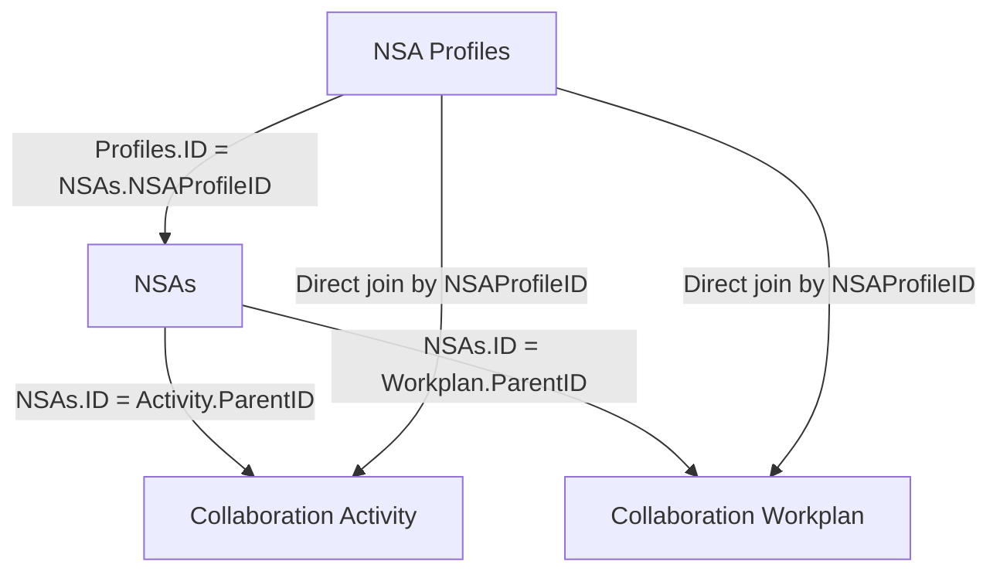

# DEV Data Structure Validation Report

**System:** PAHO Non-State Actors Public Report  
**Environment:** DEV  
**Validation date:** 2026-07-24  
**Result:** **Functional structure passed with data/export exceptions**

<a id="top"></a>
## Contents

1. [Objective](#objective)
2. [Scope](#scope)
3. [Expected structure](#expected-structure)
4. [Validation results](#validation-results)
5. [Limitations](#limitations)
6. [Conclusion](#conclusion)

<a id="objective"></a>
## Objective

Validate the new DEV data structure, including the additional `NSA Profiles`
("abuela") table, and verify the new relationships against
`NSA.Tool.Data.Structure.for.Public.Report.pdf`.

[Back to top](#top)

<a id="scope"></a>
## Scope

| Source | Records |
|---|---:|
| `NSA.Profiles.csv` | 46 |
| `NSAs.DEV.csv` | 22 |
| `Collaboration.Activity.DEV.csv` | 14 |
| `Collaboration.Workplan.DEV.csv` | 34 |

The validation covered the exported data and relationship rules. The exports do
not contain SharePoint index configuration or performance measurements.

[Back to top](#top)

<a id="expected-structure"></a>
## Expected structure

```text
NSA Profiles.ID
  -> NSAs.NSAProfileID

NSAs.ID
  -> Activity.ParentID
  -> Workplan.ParentID

NSA Profiles.ID
  -> Activity.NSAProfileID
  -> Workplan.NSAProfileID
```

`NSA Profiles.ID` identifies the organization. `NSAs.ID` identifies a specific
submission/cycle. This separation prevents a submission ID from being treated
as the permanent organization identifier.



[Back to top](#top)

<a id="validation-results"></a>
## Validation results

### Relationships

| Check | Result |
|---|---|
| Additional `NSA Profiles` table is present | Pass |
| NSAs with a valid Profile reference | 21 of 22 |
| Activity records with an exported NSAs parent | 12 of 14 |
| Workplan records with an exported NSAs parent | 32 of 34 |
| Profile mismatches where both parent and child are available | 0 |

Exceptions:

1. `NSAs.ID = 41` has a blank `NSAProfileID`.
2. Four child records reference `ParentID = 60`, but `NSAs.ID = 60` is not
   present in the supplied export:
   - `NSA-2026-60-A_1`
   - `NSA-2026-60-A_2`
   - `NSA-2026-60-WPA_1`
   - `NSA-2026-60-WPA_2`

The four child records contain `NSAProfileID = 43`, but their submission/cycle
relationship cannot be confirmed without the parent record.

### Functional fields

The exports are consistent with the PDF guidance:

| Purpose | Field |
|---|---|
| Organization identity | `NSA Profiles.ID` / `NSAProfileID` |
| Submission identity | `NSAs.ID` / `ParentID` |
| Submission type | `NSAs.NSA_Status` |
| Public-report eligibility | `NSAs.GovBodies_Status` |
| Organization type | `NSA Profiles.NSAOrganizationType` |
| Collaboration period | `NSAs.CollaborationPeriod` |

The data also confirms that `TypeOfSubmission` must not be used as the current
submission type. For example, `NSAs.ID = 96` has
`TypeOfSubmission = New Application` and `NSA_Status = Progress Report`.

[Back to top](#top)

<a id="limitations"></a>
## Limitations

- The relationship model avoids the identified risk of confusing organization
  and submission IDs, but the previous bug was not reproduced or regression
  tested as part of this data review.
- The PDF identifies `RenewalKey` as indexed. The CSV/JSON exports cannot
  confirm which other SharePoint columns are physically indexed.
- Performance was not measured. The reviewed exports are sufficient for
  functional relationship validation, not for load or query-performance
  validation.
- No record in the supplied NSAs export has `GovBodies_Status = Pending`, so
  that eligibility case was not exercised.

[Back to top](#top)

<a id="conclusion"></a>
## Conclusion

The additional `NSA Profiles` table provides a stable organization identifier,
and the populated relationships are consistent wherever the required parent
record is present.

The functional structure passes with the exceptions listed above. Physical
index configuration, end-to-end regression of the previous bug, and performance
remain outside the evidence available in these exports.

[Back to top](#top)
