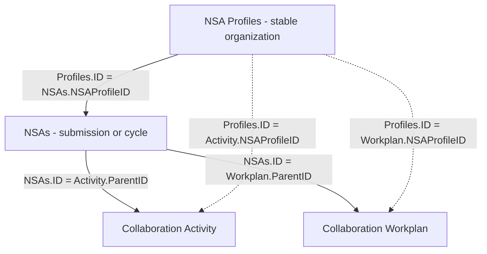
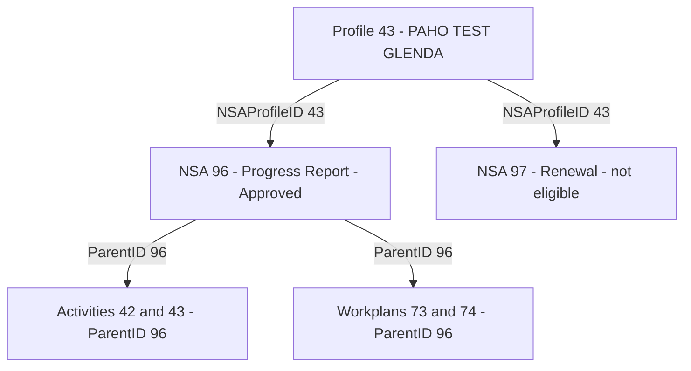

# DEV Data Structure Validation Report

**System:** PAHO Non-State Actors Public Report  
**Environment:** DEV  
**Validation date:** 2026-07-24  
**Overall result:** [**Passed with exceptions**](#result-justification)

## Table of Contents

1. [Objective](#objective)
2. [Scope](#scope)
3. [JSON data sources](#json-data-sources)
4. [Reason for the additional table](#additional-table)
5. [Validated relationships](#validated-relationships)
6. [Structural validation](#structural-validation)
7. [Functional rules from the PDF](#functional-rules)
8. [Worked validation example: Profile 43](#profile-43)
9. [Indexing strategy validation](#indexing-strategy)
10. [Validation result](#validation-result)
11. [Conclusion](#conclusion)

<a id="result-justification"></a>
## Overall result justification

The new DEV structure and the additional `NSA Profiles` table passed the functional validation. The organization and submission identities are correctly separated, and all populated relationships are consistent with the model defined in the PDF.

The result includes exceptions because two source-data inconsistencies were found:

1. `NSAs.ID = 41` has no `NSAProfileID`, so its organization cannot be identified.
2. Four Activity and Workplan records use `ParentID = 60`, but `NSAs.ID = 60` is missing from the supplied export.

These observations do not invalidate the new structure or the indexing strategy. They are incomplete DEV records that prevent full relationship validation only for the affected rows.

[Back to top](#top)

<a id="objective"></a>
## 1. Objective

> Validate the new DEV database structure, including the additional ("abuela") table. Confirm that the previous indexing bug has been resolved and verify that the new table relationships and indexing strategy meet performance and functional expectations.

This report validates the four-list DEV structure, with emphasis on the additional `NSA Profiles` list, the stability of organization identifiers, and the relationships between profiles, submissions, activities, and workplans.

<a id="scope"></a>
## 2. Scope

The validation used the following DEV exports:

| Source | Records | Columns |
|---|---:|---:|
| `NSA.Profiles.csv` | 46 | 20 |
| `NSAs.DEV.csv` | 22 | 53 raw columns |
| `Collaboration.Activity.DEV.csv` | 14 | 26 |
| `Collaboration.Workplan.DEV.csv` | 34 | 60 |

The expected structure and business rules were compared with `NSA.Tool.Data.Structure.for.Public.Report.pdf`.

The validation covered:

- relationships between the four lists;
- separation between organization identity and submission identity;
- submission-type and eligibility fields;
- consistency of `ParentID` and `NSAProfileID`;
- suitability of the new identification strategy.

<a id="json-data-sources"></a>
## 3. JSON data sources

The four CSV exports were normalized into four JSON datasets. Empty columns were preserved as object keys with `null` values so that every object keeps a consistent structure.

### 3.1 `nsa-profiles.json`

Represents the permanent organization record.

The PDF defines NSA Profiles as:

> "One record per organization. Stable org data - the source of truth across all cycles."

Important fields:

| Field | Purpose |
|---|---|
| `ID` | Permanent organization identifier |
| `Title` | Organization name |
| `NSAOrganizationType` | Source for the Organization Type filter |
| `NSAObjectives` | Organization objectives |
| `NSAWorkFields` | Main fields of work |
| `NSAOrganizationBodies` | Organization bodies |
| `NSAWebsite` | Organization website |
| `NSAYearOfEstablishment` | Establishment year |
| `RenewalKey` | Indexed backend join key with no report-facing role |

Relationship:

```text
NSA Profiles.ID -> NSAs.NSAProfileID
```

One Profile may be related to multiple NSAs submissions.

### 3.2 `nsa.json`

Represents individual submission and collaboration cycles.

The PDF defines NSAs as:

> "One record per Collaboration Period submission (New Application / Renewal / Progress Report cycle)."

Important fields:

| Field | Purpose |
|---|---|
| `ID` | Unique identifier of the submission/cycle |
| `NSAProfileID` | Links the cycle to the permanent organization |
| `NSA_Status` | Actual submission type used by the report |
| `TypeOfSubmission` | Original submission classification; not reliable for identifying Progress Reports |
| `CollaborationPeriod` | Collaboration period of the submission |
| `GovBodies_Status` | Final Governing Bodies decision and report eligibility |
| `Status` | Current workflow progress |
| `ActivitiesExtractionCompleted` | Activity extraction processing state |

Relationships:

```text
NSAs.NSAProfileID -> NSA Profiles.ID
Activity.ParentID -> NSAs.ID
Workplan.ParentID -> NSAs.ID
```

### 3.3 `activity.json`

Represents activities carried out during the prior two years and extracted for New Application submissions.

Important fields:

| Field | Purpose |
|---|---|
| `ActivityID` / `ID` | Identifies the Activity record |
| `ParentID` | Links the Activity to one specific NSAs submission |
| `NSAProfileID` | Directly links the Activity to the organization |
| `Entity` | Responsible entity |
| `Description` | Activity description |
| `DirectResults` | Direct results of the activity |
| `FormLanguage` | Original form language |
| Translation fields | English, Spanish, French, and Portuguese variants |
| `TranslationComplete` | Translation processing status |

Relationships:

```text
Activity.ParentID -> NSAs.ID
Activity.NSAProfileID -> NSA Profiles.ID
```

### 3.4 `workplan.json`

Represents the planned activities for the three-year collaboration workplan and carries annual Progress Report results.

Important fields:

| Field | Purpose |
|---|---|
| `Reference` / `ID` | Identifies the Workplan record |
| `ParentID` | Links the Workplan to one specific NSAs submission |
| `NSAProfileID` | Directly links the Workplan to the organization |
| `Description` | Planned activity description |
| `ExpectedResults` | Expected results |
| `StrategicPlan` | Related strategic plan |
| `HealthAgenda` | Related health agenda |
| `ResponsibleEntity` | Responsible organization/entity |
| `Year1_*`, `Year2_*`, `Year3_*` | Annual results, reported flags, and dates |
| Translation fields | English, Spanish, French, and Portuguese variants |
| `TranslationComplete` | Translation processing status |

Relationships:

```text
Workplan.ParentID -> NSAs.ID
Workplan.NSAProfileID -> NSA Profiles.ID
```

<a id="additional-table"></a>
## 4. Reason for the additional table

Without `NSA Profiles`, the application could treat `NSAs.ID` as the permanent identifier of an organization.

This creates a potential indexing and relationship bug because `NSAs` contains one record per submission cycle. The same organization may receive a different `NSAs.ID` for a New Application, Renewal, or Progress Report.

The PDF describes the lists as:

> "NSA Profiles - One record per organization. Stable org data - the source of truth across all cycles."

> "NSAs - One record per Collaboration Period submission (New Application / Renewal / Progress Report cycle)."

The additional table solves the risk by separating:

| Identifier | Purpose |
|---|---|
| `NSA Profiles.ID` | Permanent organization identifier |
| `NSAs.ID` | Identifier of one submission/cycle |
| `NSAs.NSAProfileID` | Relationship between the cycle and the organization |

Therefore, a new submission can receive a new `NSAs.ID` without changing the organization's permanent identity.

<a id="validated-relationships"></a>
## 5. Validated relationships

The PDF defines:

> "Collaboration Workplan.ParentID and Collaboration Activity.ParentID -> NSAs.ID"

> "Both also carry NSAProfileID for direct org-level joins without going through NSAs"

> "NSAs.NSAProfileID -> NSA Profiles.ID"



The two child relationships have different purposes:

- `NSAProfileID` identifies the organization;
- `ParentID` identifies the exact submission/cycle.

This prevents activities and workplans from different cycles of the same organization from being mixed.

<a id="structural-validation"></a>
## 6. Structural validation

### 6.1 NSAs to NSA Profiles

Expected relationship:

```text
NSAs.NSAProfileID -> NSA Profiles.ID
```

| Result | Count |
|---|---:|
| NSAs records | 22 |
| Valid profile references | 21 |
| Invalid nonblank references | 0 |
| Blank `NSAProfileID` | 1 |

Exception:

```text
NSAs.ID = 41
Title = TEST NSA
NSAProfileID = blank
```

All populated `NSAProfileID` values reference existing Profiles.

### 6.2 Activity and Workplan to NSAs

Expected relationships:

```text
Activity.ParentID -> NSAs.ID
Workplan.ParentID -> NSAs.ID
```

| Dataset | Records | Valid parents | Orphan records |
|---|---:|---:|---:|
| Activity | 14 | 12 | 2 |
| Workplan | 34 | 32 | 2 |

The four orphan records reference `ParentID = 60`, but `NSAs.ID = 60` was not included in the export:

```text
NSA-2026-60-A_1
NSA-2026-60-A_2
NSA-2026-60-WPA_1
NSA-2026-60-WPA_2
```

They still contain `NSAProfileID = 43`, so the organization is known, but their exact submission context cannot be fully validated.

### 6.3 Relationship consistency

For all comparable records, the following rule was validated:

```text
child.NSAProfileID =
parent NSAs.NSAProfileID
```

<a id="functional-rules"></a>
## 7. Functional rules from the PDF

### 7.1 Submission type

The PDF identifies `NSAs.NSA_Status` as the field to use for the submission type.

The DEV data confirms why `TypeOfSubmission` must not be used for this purpose:

```text
NSAs.ID = 96
TypeOfSubmission = New Application
NSA_Status = Progress Report
```

The actual cycle is a Progress Report. Therefore:

```text
Submission type -> NSAs.NSA_Status
```

### 7.2 Public-report eligibility

The PDF defines the eligible Governing Bodies statuses as:

```text
NSAs.GovBodies_Status = Pending
OR
NSAs.GovBodies_Status = Approved
```

`NSAs.Status` represents workflow progress and is not the permanent public-report eligibility field.

Therefore:

```text
Eligibility -> NSAs.GovBodies_Status
Workflow progress -> NSAs.Status
```

### 7.3 Other relevant fields

| Purpose | Source |
|---|---|
| Organization Type filter | `NSA Profiles.NSAOrganizationType` |
| Collaboration period | `NSAs.CollaborationPeriod` |
| Submission type | `NSAs.NSA_Status` |
| Final Governing Bodies status | `NSAs.GovBodies_Status` |
| Organization identity | `NSA Profiles.ID` / `NSAProfileID` |
| Submission identity | `NSAs.ID` / child `ParentID` |

`RenewalKey` is described in the PDF as an indexed backend join key with no report-facing role. It is not required to select the public submission.

<a id="profile-43"></a>
## 8. Worked validation example: Profile 43

Profile 43 represents:

```text
NSA Profiles.ID = 43
Title = PAHO TEST GLENDA
```

Two NSAs submissions reference this Profile:

| Field | NSA 96 | NSA 97 |
|---|---|---|
| `NSAProfileID` | 43 | 43 |
| `TypeOfSubmission` | New Application | Renewal |
| `NSA_Status` | Progress Report | Renewal |
| `CollaborationPeriod` | 2025-2027 | Blank |
| `Status` | Pending Report Submission | Submitted |
| `GovBodies_Status` | Approved | Blank |
| Public-report eligible | Yes | No |

NSA 96 is the eligible submission because its `GovBodies_Status` is `Approved`.

Its valid child relationships are:

```text
Activities IDs 42 and 43 -> ParentID 96 -> NSAProfileID 43
Workplans IDs 73 and 74 -> ParentID 96 -> NSAProfileID 43
```



This example confirms that:

- one stable Profile can have multiple NSAs cycles;
- `GovBodies_Status` determines which cycle is eligible;
- `NSA_Status` identifies the actual submission type;
- `ParentID` keeps Activity and Workplan linked to the correct cycle;
- `NSAProfileID` keeps all records linked to the organization.

<a id="indexing-strategy"></a>
## 9. Indexing strategy validation

The previous risk existed because a cycle-specific `NSAs.ID` could be used as if it were a permanent organization identifier.

The new structure resolves this by using:

```text
NSA Profiles.ID -> permanent organization identity
NSAs.NSAProfileID -> organization relationship
NSAs.ID -> submission identity
Activity/Workplan.ParentID -> submission relationship
Activity/Workplan.NSAProfileID -> direct organization relationship
```

This strategy supports the expected access patterns:

1. locate an organization through its stable Profile ID;
2. locate all submission cycles through `NSAProfileID`;
3. identify eligible submissions through `GovBodies_Status`;
4. locate Activity and Workplan rows for one cycle through `ParentID`;
5. group historical child rows by organization through `NSAProfileID`.

The relationships are direct, unambiguous, and avoid using a changing submission ID as the permanent organization key. No structural performance issue was identified in the reviewed DEV data.

<a id="validation-result"></a>
## 10. Validation result

| Validation criterion | Result |
|---|---|
| Additional `NSA Profiles` table is present | Pass |
| Stable organization identifier is available | Pass |
| Potential bug caused by changing `NSAs.ID` is prevented | Pass |
| NSAs-to-Profile relationships are consistent | Pass with one blank Profile |
| Child-to-NSAs relationships are consistent | Pass with four orphan records |
| Submission type can be identified correctly | Pass using `NSA_Status` |
| Public-report eligibility can be identified | Pass using `GovBodies_Status` |
| Activities and Workplans remain separated by cycle | Pass using `ParentID` |
| Organization-level grouping is supported | Pass using `NSAProfileID` |
| Indexing strategy supports functional expectations | Pass |

<a id="conclusion"></a>
## 11. Conclusion

The additional `NSA Profiles` table successfully introduces a stable organization identifier and prevents the potential bug that could occur if `NSAs.ID` were used as a permanent organization key.

The validated model correctly separates:

```text
organization identity -> NSA Profiles.ID
submission identity -> NSAs.ID
organization relationship -> NSAProfileID
submission relationship -> ParentID
```

The relationships found in the supplied DEV data are consistent and support the expected functional and performance access patterns.

The structure is considered valid, with two data exceptions that should be corrected in the source:

1. `NSAs.ID = 41` has no `NSAProfileID`;
2. four Activity/Workplan records reference the missing `NSAs.ID = 60`.

These exceptions do not invalidate the new model, but they prevent complete relationship validation for the affected records.
